# Dreamsequence

Chord-based sequencer, arpeggiator, and harmonizer for Monome Norns+Grid

Required: Monome Norns (**240221 or later**) and Grid (16x8 or 16x16)

Optional: Supports MIDI and Crow by default. Installation of additional [NB voices](https://llllllll.co/t/n-b-et-al-v0-1/60374) is highly recommended!

[Dreamsequence demo and basics on YouTube](https://youtu.be/MztashV-zaI)

---

# Intro

Dreamsequence is a chord-based sequencer, arpeggiator, harmonizer, and arranger for Monome Norns+Grid. It employs bit of music theory magic to quickly create harmonious compositions from simple inputs like Grid patterns, MIDI, and CV.

I hope you have as much fun using Dreamsequence as I have had creating it, and I'd love to hear about how you're using it at l.llllllll.co/dreamsequence

Cheers,
Dan

--- 

# Overview

This Overview will explain how the components that make up Dreamsequence operate. It's a bit dry and technical, so if you are more of the skim-the-manual type, feel free to [install some NB voices](https://llllllll.co/t/n-b-et-al-v0-1/60374) then skip ahead to the [Grid interface](https://github.com/dstroud/dreamsequence/blob/main/README.md#grid-interface) guide. You'll likely want to keep the [Norns interface](https://github.com/dstroud/dreamsequence/blob/main/README.md#norns-interface) guide handy for reference.

> **_NOTE:_** Dreamsequence supports saving/loading of your song through the system PARAMETERS>>PSET menu but you should expect these saves to break when doing updates. I'll do my best to notify of breaking changes in patch notes, but things will be missed and I recommend you wrap up any work before updating.
>

## Chord sequencer
*Grid-based chord pattern sequencer.*
- The chord pattern sequencer is the heart of Dreamsequence, always broadcasting an "active" chord that the rest of Dreamsequence uses to create sequences and harmonies.
- The active chord can be sent to an output for playback (MIDI, Norns engine, i2c, etc...) or it can be muted.
- Chord patterns are references to chord degrees (I-VII) across two octaves. If you're not a music theory nerd, this just means that the palette of chords that Grid offers will always sound nice together and we can change the mood of the song by simply switching to a different mode which will change all the chords for us and cascade those changes to everything else using the active chord.
- 4 chord patterns (A, B, C, D) can be saved then switched between in a quantized manner using Grid (sort of like Ableton Live's Session mode) or the Arranger.
- New patterns and some basic song/engine randomizations can be procedurally generated by holding down the Chord view key on Grid (last column, row 7/15) and pressing K3. Or hold rows 7/15 and 8/16 then press K3 to generate Chords and Seq together.
- See the [Chord](https://github.com/dstroud/dreamsequence/blob/main/README.md#chord-menu) menu documentation for more details.

## Seq (sequencer/arp)
*Grid-based monophonic pattern sequencer (formerly ARP)*
- Seq can be configured as a chord-based arpeggiator, step sequencer, or various hybrids of the two.
- New patterns and some basic engine randomizations can be procedurally generated by holding down the Seq view key on Grid (last column, row 8/16) and pressing K3. Or hold rows 7/15 and 8/16 then press K3 to generate Chord and Seq patterns together.
- See the [Seq](https://github.com/dstroud/dreamsequence/blob/main/README.md#seq-menu) menu documentation for more details.

## MIDI Harmonizer
*Note reprocessor for chords, sequences, arpeggios, whatever*
- Transforms incoming MIDI to play notes from the selected chord or mode.
- Ideas:
  - Turn a synced step sequencer into a chord-aware secondary arpeggio, melody, bassline, etc...
  - Improvise with a MIDI controller in a live performance (no dud notes!).
  - Use a looping MIDI clip from a synced DAW to generate more complex chord voicings and timings (e.g. adding some swing).
- See the [MIDI Harmonizer](https://github.com/dstroud/dreamsequence/blob/main/README.md#midi-harmonizer-menu) menu documentation for more details.

## CV Harmonizer
*Magical sample and hold + quantizer + chord/mode remapping (requires Crow)*
- A trigger received at Crow input 2 will sample the voltage at input 1 and use this to play a notes from the selected chord or mode.
- Alternately, voltage sampling can be triggered on a fixed schedule using the Trigger setting.
- Rests can be inserted by enabling the "Auto-rest" menu option and triggering the same voltage repeatedly within a chord step.  
- Ideas:
  - Process CV from your eurorack sequencer then send it back out via Crow outputs 1-2, like a chord quantizer. 
  - Turn LFOs, function generators, S&H modules, etc... into sequencers.
  - Use trigger/clock/voltage sources for novel sequence timing or to inject some chaos into a merged output.
- See the [CV Harmonizer](https://github.com/dstroud/dreamsequence/blob/main/README.md#cv-harmonizer-menu) menu documentation for more details.

## Arranger
*Like a DAW but [worse/better]*
- Sequences playback of chord patterns (A, B, C, D) and is the entry point to the Event Editor.

- Events set, increment, randomize, or incite parameters to "wander" throughout your arrangement, with clamping or wrapping value ranges and probability control. Events can be used like rudimentary DAWesque automation lanes or they can be used more sparingly to reconfigure your patch at certain key points in your arrangement.

---

# Grid interface

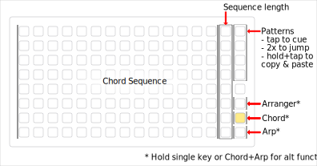

The Chord view is used to program chord patterns A-D. Since the Seq and harmonizers can create notes based on the active chord, this is typically where you'll begin composing.

- Sequence plays from top to bottom and sequence length is set using column 15. On 16x8 Grids, E1 can be used to scroll up and down the full 16 pattern steps.

- Chords are selected using columns 1-14 which represent chord degrees I-VII across two octaves. Pressing and holding a key will display the corresponding chord on the Norns screen Pattern Dashboard (upper right). A setting is available via K1>>PARAMETERS>>EDIT>>PREFERENCES to change that readout to show chord names or Roman numeral chord degrees.

- Rows 1-4 of the rightmost column represent 4 chord patterns: A, B, C, D.
  - Tapping a pattern will turn off the Arranger and cue that pattern to play once the current pattern is completed.
  - While stopped/paused, double-tapping a pattern will turn off the Arranger and immediately jump to that pattern. Likewise, tapping the currently playing pattern once will turn off the Arranger and reset the current pattern.
  - Holding one pattern and tapping on another will copy and paste chords from the held pattern without causing the pattern/cue to change.

- The last three keys on the bottom of the rightmost column switch between Arranger, Chord, and Seq views.
  - Holding the Chord view key enables alternate functions:
    - E2 rotates the looped portion of the chord sequence.
    - E3 shifts the chord pattern left or right, decrementing or incrementing chord degrees.
    - K3 generates a new chord sequence and also randomizes some related parameters like mode, key, and tempo.
    - Holding the Chord+Seq view keys together enables K3 to generate both a new chord sequence and a new Seq.

----------------------------------------------------------------------------------------------------------------------
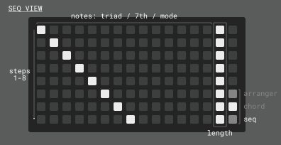

The Seq view is used to program the notes in the monophonic sequence/arpeggio/strum pattern.

- Each column represents a different note pitch, determined by one of the following "Notes" Seq menu options:
	- Triad: columns 1-3 map to notes 1-3 from the active chord interpreted as a triad. Columns 4-6 play the same notes one octave up, etc..
	- 7th: columns 1-4 map to notes 1-4 from the active chord interpreted as a 7th chord. Columns 5-8 play the same notes one octave up, etc..
	- Mode+transp.: columns 1-7 play notes from the selected mode and apply a diatonic transposition based on the active chord degree. Columns 8-14 play the same one octave up. Example: In C Major degree I, columns 1-7 would be C, D, E, F, G, A, B. Degree ii would result in D, E, F, G, A, B, C.
	- Mode: columns 1-7 play notes from the selected mode, columns 8-14 play the same one octave up.
	- Chromatic: columns 1-14 play chromatic semitones.

- Seq plays from top to bottom and sequence length is set using column 15. On 16x8 Grids, E1 can be used to scroll up and down the full 16 pattern steps. After completing the sequence, the playhead will reset to the beginning and wait to start playback again based on the Seq "Start on" setting.

- The last three keys on the bottom of the rightmost column switch between Arranger, Chord, and Seq views.
  - Holding the Seq view key enables alternate functions:
    - E2 rotates the looped portion of the Seq pattern.
    - E3 shifts the Seq pattern left or right.
    - K3 generates a new Seq pattern.
    - Holding the Seq+Chord view keys together enables K3 to generate both a new chord sequence and a new Seq.

----------------------------------------------------------------------------------------------------------------------
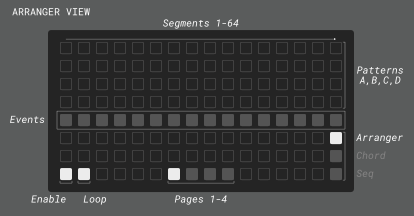

The Arranger view is used to sequence chord patterns and enter the Events view.

- Rows 1-4 correspond to chord patterns A-D and columns 1-16 represent "segments" of the Arranger sequence. The Arranger length automatically resizes to the rightmost set pattern and any gaps in the sequence are filled in lighter colors to indicate that the previous chord pattern will be sustained. If the first segment isn't filled it will default to pattern A or it will grab the last populated pattern (since the Arranger loops).

- Row 5 is the Arranger Timeline, which illuminates segments contains one or more events. Holding down a key on the Arranger Timeline will enable alternate functions:
  - E3 shifts the selected segment and subsequent segments to the right or left depending on the direction of rotation.
  - K2 will cue the playhead to jump to the selected segment after the current segment is finished.
  - K3 enters the Events view view (see next section).
  - Holding a segment on the timeline and tapping on another will copy and paste events from the held segment. You can also hold a segment and tap rows 1-4 to set a pattern and paste events at the same time.

- Grid keys on the bottom left enable or disable the Arranger and Arranger Loop mode, respectively.

- Page keys 1-4 extend the arranger beyond 16 steps. Note that the arranger view does not currently follow the playhead off-screen so it's up to you to chase it down.
 
- The last three keys on the bottom of the rightmost column switch between Arranger, Chord, and Seq views. 

----------------------------------------------------------------------------------------------------------------------
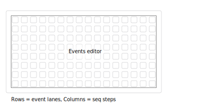

The Events view is used to manage the scheduling of parameter changes and functions at certain points in the Arrangement.

- Events view is entered by holding down a segment on the Arranger Timeline (row 5) then pressing K3. Think of it as zooming in on that segment- and thus the chord pattern (A-D).

- Grid displays a view of events in the Arranger segment, where events fire left-to-right then top-to-bottom (like reading in English).
  - Rows 1-16 represent each step in the segment's chord pattern, just like on the Grid chord view. We don't show a playhead moving from top to bottom but it might help to imagine it. Grid keys will be dimly-illuminated to indicate the length of the assigned pattern (A-D). Note that you can create events beyond the range of the chord pattern's length- they just won't fire.
  - Columns 1-16 are event 'lanes' that fire left-to-right just before the chord on that step plays.
    
> **_TIP:_** To make it easier to keep track of your events, consider dedicating one lane/column to a certain type of event, such as having chord velocity changes in lane 1, pattern manipulations in lane 2, etc.. or just embrace chaos.
> 

- Tapping on an unpopulated/dim event position will open the event settings and display "(New)" in the header. Settings will default to the last touched event so you can just tap a key, change a value, save, and repeat x times to build a sequence of related events.
    
- Tapping on a populated/bright event will open the event settings for that event and display "(Saved)" in the header. Making any changes to the settings will display "(Edited)" in the header.

- While viewing an event's settings, use E2 and E3 to select menus and make changes. K3 saves and closes the event settings screen, and K2 deletes the event. If you don't want to delete or save changes to an event just tap the illuminated event slot on Grid and it will revert to the saved state so you can exit with K3.

- Holding one event and tapping on one or more slots will copy and paste the settings from the held event- this can also be used to paste an empty event over a populated one, effectively deleting it.

- If no event is selected immediately after launching the Events view or after deleting/saving an event, K3 will take you back to the Arranger and holding K2 until the countdown completes will delete all events in the segment.

---

# Norns interface

## Norns keys and encoders

- Key 1 (K1): System menus

- Key 2 (K2): Pause/Stop(2x)
	- Default K2 behavior is to pause playback on a single press and stop on a second press.
	- Pausing is only available when using Internal clock source.
	- Stopping resets the active chord pattern and will reset the Arranger if it is enabled.
  	- Under certain conditions, alternate functions are enabled and will be shown in the footer section at the bottom of the Norns screen:
    		- While holding down an Arranger Timeline key: cue the playhead to jump to the selected segment after the current segment is finished.
    		- While in the Events view screen: delete selected event or hold to delete all events in the segment.

- Key 3 (K3): Play
	- Default K3 behavior K3 starts playback.
   	- When using Internal clock source, K3 continues after pausing. Settings are available for each MIDI clock port via K3>>PARAMETERS>>EDIT>>PREFERENCES:
   		- The “song” option will send out MIDI Song Position Pointer (SPP) and ‘continue’ messages which should work well for things like DAWs.
		- The “pattern” setting will cause Dreamsequence to continue playback and then send a ’start’ message at the beginning of the next measure. This works well for devices that don’t support SPP: drum machines, loopers, Ableton live’s “Session” view, etc…
		- In order for ‘pattern’ mode to work as expected, you must set a time signature via SONG>>Beats per bar/Beat length (time signature numerator and denominator). Changing the time signature requires restarting playback.

	- Under certain conditions, alternate functions are enabled and will be shown in the footer section at the bottom of the Norns screen:
		- While holding down an Arranger Timeline key: enter Event view.
    		- While in the Events view screen: save event or return back to Arranger.
    		- While holding Chord, Seq, or Chord+Seq Grid view keys (last two keys on the rightmost column): Generate a new chord pattern, Seq pattern, or both.

- Encoder 1 (E1): Scroll pattern
  - For 16x8 Grids, extends the Chord and Seq pattern views up to 16 steps.

- Encoder 2 (E2): Select menu
  - Scroll up/down to select a menu.
  - In certain states, alternate functions are enabled: 
    - While holding Chord or Seq Grid view keys (last two keys on the rightmost column): rotate the looped portion of the active pattern up or down.

- Encoder 3 (E3): Edit menu
  - Changes the value of the selected menu item, including changing the 'page' on top level menus.
  - In certain states, alternate functions are enabled: 
    - While holding Chord or Seq Grid view keys (last two keys on the rightmost column): shift the selected pattern left or right.
    - While holding down a key on the Arranger Timeline (row 5): shift the selected segment and following segments to the right or left depending on the direction of rotation.

## Norns screen

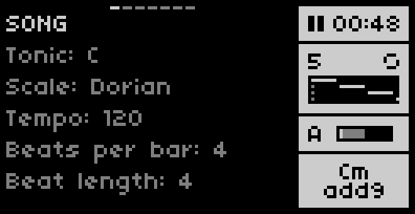

Most of your work on Norns will be done through 5 main menus that look like the example above. Scrolling to the top menu (SONG in the example above) with E2 will allow you to browse using E3. Before taking a closer look at the contents of these menus, let's take a look at the mini dashboards on the right side of the screen.

----------------------------------------------------------------------------------------------------------------------
 
### Pattern Dashboard

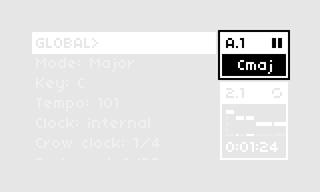

- This dashboard gives us a summary of transport status, the current chord pattern (A-D) and active chord.
- The values in the top left of the dash provide information about the current pattern in the format 'PATTERN'.'CURRENT STEP'. Example: “A.3” means pattern A, step 3. ‘RST’ appears when pattern has been reset.
- Play/pause/stop symbols in the upper right convey the current transport state.
- In the center of the dash, the active chord will be displayed. Holding down a chord sequence key on the Chord Grid view will temporarily overwrite this to indicate the chord that corresponds to the held key. The chord readout can be changed from chord name to chord degree using K1>>PARAMETERS>>EDIT>>PREFERENCES>>"Chords as: Degree".

> **_TIP:_** Active chord reflects the CHORD>>"Chord type" menu option (Triad or 7th) but each sequencer/harmonizer can override this with the similar "Notes" menu.
> 

----------------------------------------------------------------------------------------------------------------------

### Arranger Dashboard

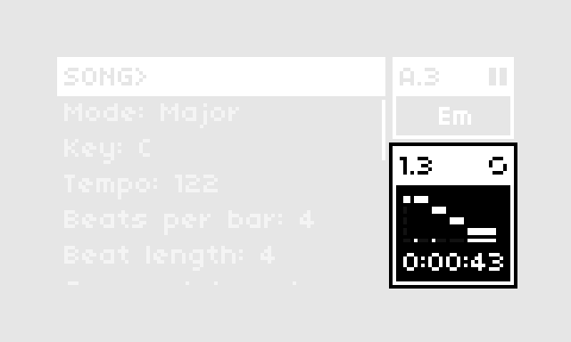

- Dashboard will be brightly illuminated when Arranger is enabled, and dimmed when disabled.
- The numbers in the top left indicate the current Arranger segment and step in the format 'SEGMENT'.'STEP'. "1.3" in the example above means the Arranger is on step 3 of the 1st Arranger segment. "RST" indicates the Arranger has been reset to its initial position.
- To the right, a symbol will indicate if the Arranger is in Loop mode (circular symbol as in the example above) or One-shot mode (arrow symbol). This symbol will flash when on the last segment of the Arranger as a heads-up.
- In the middle of the dashboard, a mini chart shows the current and upcoming Arranger segments. One advantage this dashboard has over Grid for live performances is that it gives an indication of segment/chord pattern length.
- At the bottom of the chart is a timeline that highlights any steps that have an event. In the example above, events occur on the first step of the 2 upcoming segments, and on every step of the last segment.
- At the very bottom of the dash is a readout of the remaining time in the arrangement.
- Interrupting the Arranger (by turning it off manually on the Arranger Grid view or changing chord patterns on the Chord Grid view) will turn it off and enter a suspended state where the current chord pattern continues to play in a loop. In this state, the dashboard changes to show
	-  The segment the Arranger will resume on once it has turned on and and resynchronizes and the number of steps remaining until that can occur. Formatted as 'RESUMING SEGMENT'.'STEPS UNTIL RESYNC' 
	- "LP" or "EN" indicates that we are on the last segment of the arrangement and resuming the Arranger will result in looping (LP) to the beginning or ending (EN) of the arrangement, depending on the Arranger mode.
	- The remaining time in arrangement upon arranger resume. Time remaining on the active pattern is not counted because it’s technically not part of the arrangement.
    
----------------------------------------------------------------------------------------------------------------------

### Menus
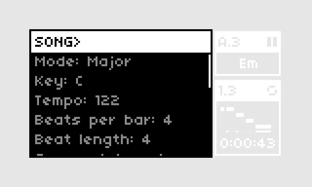

The left portion of the Norns screen displays one of the following "pages" and associated menu items:
  - SONG <> CHORD <> SEQ <> MIDI HARMONIZER <> CV HARMONIZER
 
To navigate between pages, use E2 to scroll to the top of the list of menu items until the page name is highlighted, then use E3 to change the page. To change a menu item, simply scroll down the list using E2 and change its value using E3. < and > symbols will appear when you are at the end of the range of possible values. Descriptions of each page and menu options follow.

#### SONG menu

- Mode: 9 modes: Major, Natural Minor, Harmonic Minor, Melodic Minor, Dorian, Phrygian, Lydian, Mixolydian, Locrian.

- Key: Song transposition of +/- 12 semitones.

- Tempo: sets Norns system clock tempo in BPM.

- Beats per bar: Time signature numerator. Used when syncing MIDI devices using "pattern" mode (K3>>PARAMETERS>>EDIT>>PREFERENCES MIDI CLOCK OUT).

- Beats length: Time signature denominator. Used when syncing MIDI devices using "pattern" mode (K3>>PARAMETERS>>EDIT>>PREFERENCES MIDI CLOCK OUT).
 
- Clock: System clock setting.
	- System clock source; MIDI clock out ports must be set via K1>>PARAMETERS>>CLOCK

	- Internal clock source allows pause/continue with "song" or "pattern" modes available to sync MIDI devices. Other clock sources will stop/start but not continue.

- Crow outs: Outs 1-3 have options for "Off", "CV", "Env", and "Events". Out 4 also includes Dreamsequence's custom clock out option. Unlike the system Crow clock, this clock only runs when transport is playing, and has an option for swing. For best results, make sure the system Crow clock is disabled in PARAMETERS>>CLOCK.
  
- Crow clk: Frequency of the pulses from Crow out port 4. Frequency is conveyed as fractions of a measure, with Pulses Per Quarter Note (PPQN) in parenthesis.

- Crow swing: Amount of swing applied to the outgoing Crow clock. 50% is 0 swing and 99% is the maximum swing.

- Dedupe <: This enables and sets the threshold for detecting and de-duplicating repeat notes at each output. This can be particularly helpful when merging sequences from different sources (say combining harmonizer with chords). Rather than trying to send the same note twice (potentially resulting in truncated notes or phase cancellation issues), this will let the initial note pass and filter out the second note if it arrives within the specified period of time.

- C-gen: Which algorithm is used for generating _Chord_ patterns. The default value picks an algorithm randomly.

- S-gen: Which algorithm is used for generating _Seq_ patterns. The default value picks an algorithm randomly.

#### CHORD menu

- Voice: Where the output of the chord sequence is sent for playback. Default options include Crow and MIDI ports, but additional synths and devices are supported by installing [NB voice mods](https://llllllll.co/t/n-b-et-al-v0-1/60374).

- Chord type: Selects between triads and 7th chords and displays the chord readout as such. Note that each sequence source can set this independently so it's possible for the Chord sequencer to output triads while the other sources output 7ths (and vice versa).

- Octave: Shifts output from -4 to +4 octaves.

- Range: Expands or shrinks the chord's pitch range, measured in note intervals. An asterisk (*) will appear if this value is less than the "Max notes" parameter, indicating that the value shown here is limiting the number of notes played. Note that a Range of 3 will effectively play 7th chords as triads.

- Max notes: Applied after Range has been set, this parameter limits the number of notes in the chord using a note thinning algorithm. The algorithm prioritizes the first and last notes in the chord, after which the intermediate notes are thinned out and evenly distributed. The resulting chord voicing depends on Range, Max notes, and Inversion. It's possible to end up with some false "chords" like the same note repeated across multiple octaves.
 
- Inversion: Incrementally shifts the lowest note up an octave so that 1 = first inversion, 2 = second inversion, etc... Multiples of 3 (for triads) or 4 (for 7ths) will effectively transpose the sequence up an octave which might be desired when incrementing this parameter with an event automation.

- Strum: Determines if the chord's notes will play all at once (Off), or strum notes in one of two directions (Low-high or High-low).

- Strum length: Length of the strum as a fraction of the chord Step length. The timing of the individual notes is adaptive, depending on the number of notes being strummed.

- Strum curve: Bipolar control (-100% to +100%) over note timing where negative values will cause note timing to slow down over time and positive values will cause note timing to speed up over time. A value of 0% will result in linear timing.

- Step length: The length of each step/row in the chord pattern, relative to 1 measure. Values ending in T are tuplets.

- Duration: Chord note duration relative to 1 measure. Values ending in T are tuplets. The first option, "Step" will always adjust note length to match step length.

- Swing: Amount of swing applied. 50% is 0 swing and 99% is the maximum swing.

- Dynamics: Volume or amplitude of voice.

- Ramp: Bipolar control (-100% to +100%) of the Velocity/Amp values for each note. When Strum is off, this will change the dynamic balance of low and high pitched notes in the chord. When strumming, negative values will lower dynamics over time and positive values will raise dynamics over time.
 
#### SEQ menu

- Voice: Where the output of the Seq is sent for playback. Default options include Crow and MIDI ports, but additional synths and devices are supported by installing [NB voice mods](https://llllllll.co/t/n-b-et-al-v0-1/60374).
  
- Notes: Five ways of configuring Grid's note mapping are available:
  - Triad: columns 1-3 map to notes 1-3 from the active chord interpreted as a triad. Columns 4-6 play the same notes one octave up, etc..
  - 7th: columns 1-4 map to notes 1-4 from the active chord interpreted as a 7th chord. Columns 5-8 play the same notes one octave up, etc..
  - Mode+transp.: columns 1-7 play notes from the selected mode and apply a diatonic transposition based on the active chord degree. Columns 8-14 play the same one octave up. Example: In C Major degree I, columns 1-7 would be C, D, E, F, G, A, B. Degree ii would result in D, E, F, G, A, B, C.
  - Mode: columns 1-7 play notes from the selected mode, columns 8-14 play the same one octave up.
  - Chromatic: columns 1-14 play chromatic semitones.
    
- Start on and Reset on menus: The sequence always tries to play until it completes, at which point it loops to be the beginning and is ready to start again as soon as it receives the signal to do so. These menu options determine what can send that signal to start and what can force a restart before the end of the sequence.
  - Start on:
    - Seq end: as soon as the sequence ends, it will start itself in a loop.
    - Step: start Seq when the chord sequencer advances a step.
    - Chord: start Seq when the chord sequencer advances to a step containing a chord (empty steps are ignored). Useful for turning Seq into a chord strummer, or to layer notes on top of the chord, building alternative chord types and voicings.
    - Cue: start seq Seq only when the "Start" param is triggered by an event or MIDI/OSC PMAP.
  > **_NOTE:_**  "Start" events/PMAP triggers (K1>>PARAMETERS>>EDIT>>SEQ>>Start) can be combined with any of the above configurations for additional control.
  > 

  - Reset on: The sequence can be forced to reset before its normal end using this setting Depending on when the reset occurs, this can prevent the sequence from reaching its end, keeping it in a suspended loop.
    - Step: reset Seq when the chord sequencer advances a step.
    - Chord: reset Seq when the chord sequencer advances to a step containing a chord (empty steps are ignored).
    - Stop: reset Seq when the transport is stopped and patterns are reset (not on pause).
  > **_NOTE:_**  "Stop" events/PMAP triggers (K1>>PARAMETERS>>EDIT>>SEQ>>Stop) can be combined with any of the above configurations for additional control.
  > 
   
  The following examples show how the same 6-note sequence can be reinterpreted by changing "Start on" and "Reset on" settings (chords shown below sequence).
  
  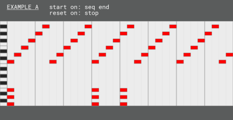

  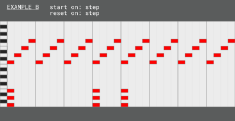

  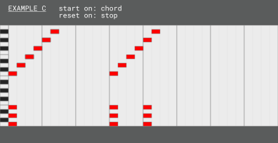

  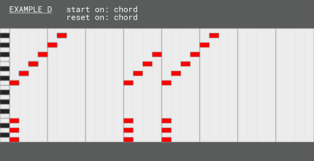

  For the sake of simplicity, these examples have one chord repeated 3 times. In practice, chord changes will also be influencing the sequence notes, which can produce mesmerizing results. Also, remember that it's possible to use events to switch between the above settings and/or directly trigger starts and resets, allowing for significantly more complex sequences than are shown here.
  
- Octave: Shifts output from -4 to +4 octaves.

- Step length: The length of each step/row in the Seq pattern, relative to 1 measure. Values ending in T are tuplets.

- Duration: Note duration relative to 1 measure. Values ending in T are tuplets. The first option, "Step" will always adjust note length to match step length.

- Swing: Amount of swing applied. 50% is 0 swing and 99% is the maximum swing.
  
- Accent: Bipolar modulation of note dynamics on upbeats.
  
- Dynamics: Volume or amplitude of voice.

#### MIDI HARMONIZER menu

- Voice: Where the output of the harmonizer is sent for playback. Default options include Crow and MIDI ports, but additional synths and devices are supported by installing [NB voice mods](https://llllllll.co/t/n-b-et-al-v0-1/60374).
  
- Notes: Five ways of mapping incoming MIDI notes to output notes are available. This works just like the Seq but instead of choosing a column on Grid, we use the incoming note value starting from C1.
    - Triad: notes C1-D1 map to notes 1-3 from the active chord interpreted as a triad. Notes D#1-F1 play the same notes one octave up, etc..
	  - 7th: columns C1-D#1 map to notes 1-4 from the active chord interpreted as a 7th chord. Columns E1-G1 play the same notes one octave up, etc..
	  - Mode+transp.: beginning with note C1, incoming notes are mapped to the mode configured in SONG>>Mode, then a diatonic transposition based on the active chord degree is applied.
	  - Mode: beginning with note C1, incoming notes are mapped to the mode configured in SONG>>Mode.
       	  - Chromatic: beginning with note C1, incoming notes are mapped to chromatic semitones.
   
- Octave: Shifts output from -4 to +4 octaves.

- Duration: Note duration relative to 1 measure. Values ending in T are tuplets.
  
- Dynamics: Volume or amplitude of voice.

#### CV HARMONIZER menu

- Voice: Where the output of the harmonizer is sent for playback. Default options include Crow and MIDI ports, but additional synths and devices are supported by installing [NB voice mods](https://llllllll.co/t/n-b-et-al-v0-1/60374).
  
- Notes: Five ways of mapping voltage send to Crow input 1 to notes are available. This works just like the Seq but instead of choosing a column on Grid, we use the incoming voltage which is then quantized to 1v/oct or 1 semitone increments.
    - Triad: voltage of 0v, 1/12v, 2/12v map to notes 1-3 from the active chord interpreted as a triad. Voltage of 3/12v, 4/12v, 5/12v play the same notes one octave up, etc..
	  - 7th: columns voltage of 0v, 1/12v, 2/12v, 3/12v map to notes 1-4 from the active chord interpreted as a 7th chord. Voltage of 4/12v, 5/12v, 6/12v play the same notes one octave up, etc..
	  - Mode+transp.: beginning with note 0v and increasing with each 1/12v increment, incoming voltage is mapped to the mode configured in SONG>>Mode, then a diatonic transposition based on the active chord degree is applied.
	  - Mode: beginning with note 0v and increasing with each 1/12v increment, incoming voltage is mapped to the mode configured in SONG>>Mode.
    	  - Chromatic: beginning with note 0v and increasing with each 1/12v increment, incoming voltage is mapped to chromatic semitones.
  
- Auto-rest: When true, this option will suppress the same note when it is repeated consecutively within one chord step, resulting in a rest. This can be a useful way of adding rest functionality into analog sequencers that don't support such a feature.

- Octave: shifts output from -4 to +4 octaves.

- Duration: Note duration relative to 1 measure. Values ending in T are tuplets. The first option, "Step" will always adjust note length to match step length.

- Swing: Amount of swing applied. 50% is 0 swing and 99% is the maximum swing.
    
- Dynamics: Volume or amplitude of voice.

---

# Preferences
- Persistent preferences can be set for the following parameters via K1>>PARAMETERS>>EDIT>>PREFERENCES
	- Save template: Press K3 to save the current script's state as a starting template
	- Load pset: Optional settings for loading a preset (pset) on script launch:
 		- Off
   		- Last: Load the last-saved pset on script launch.
     		- Template: Load the template pset (see 'Save template' above) on script launch.
	- Chords as: displays chords names (Gmaj) or chord degrees (VII).
	- Crow pullup: i2c pullup resistors can be set On (default) or Off.
 	- MIDI Clock Out: Determines behavior of synced MIDI devices when pausing/continuing:
   		- The “song” option will send out MIDI Song Position Pointer (SPP) and ‘continue’ messages which should work well for things like DAWs.
		- The “pattern” setting will cause Dreamsequence to continue playback and then send a ’start’ message at the beginning of the next measure. This works well for devices that don’t support SPP: drum machines, loopers, Ableton live’s “Session” view, etc…
		- In order for ‘pattern’ mode to work as expected, you must set a time signature via SONG>>Beats per bar/Beat length (time signature numerator and denominator). Changing the time signature requires restarting playback. 
 
---

# Crow Patching

Dreamsequence supports using Crow to send and receive CV and triggers. Outputs are configurable via Song>> Crow out x, defaulting to the following:
- Crow IN 1: CV used to determine note pitch of the CV Harmonizer. Can be unquantized or quantized. Attenuation recommended.
- Crow IN 2: Trigger in (rising past 2 volts) will sample the CV on Crow IN 1 and send a note from the CV Harmonizer
- Crow OUT 1: Default "Crow" output V/oct out
- Crow OUT 2: Default "Crow" output trigger or 10v attack/decay envelope out
- Crow OUT 3: Default used by [Arranger Events](https://github.com/dstroud/dreamsequence/blob/main/README.md#events-view).
- Crow OUT 4: Default clock out (beat-division or PPQN) set in "Song:Crow clk" menu item

---

# Changelog

v1.3

	
### Features
- Nota Bene (NB) voice support. MIDI and Crow are supported by default and additional voices can be installed via the following Maiden commands. See [the NB topic on Lines](https://llllllll.co/t/60374) for details.

	Soft synths:

	`;install https://github.com/sixolet/doubledecker`	2-layer synth a la CS-80

	`;install https://github.com/sixolet/emplaitress`	Polyphonic MI Plaits

  	`;install https://github.com/dstroud/nb_polyperc`	Norns PolyPerc

	`;install https://github.com/entzmingerc/nb_rudiments`	Rudiments percussion

 	i2c devices:

	`;install https://github.com/sixolet/nb_wsyn`	Whimsical Raps W/synth

	`;install https://github.com/sixolet/nb_jf`	Whimsical Raps Just Friends

	`;install https://github.com/sixolet/nb_ex`	Expert Sleepers Disting EX

	`;install https://github.com/sixolet/nb_ansible`	Monome Ansible
- Swing settings for Chord, Seq, CV harmonizer, and Crow clock out.
- Seq ‘Accent’ param applies a positive or negative dynamics offset to swing steps.
- "Step" duration setting adjusts note duration to always match the step length (Chord and Seq) or Trigger division (CV harmonizer).
- Pressing a Grid pattern key when transport is stopped will play that chord or note.
- Chromatic mapping option added to `Notes` parameter.
- The SONG menu now has settings for configuring Crow's outputs which will result in various CV or CV/Env pair options appearing in Voice parameters. All outs can send CV, Env, and Events while out 4 can also send a Clock pulse when transport is running.
- `Crow events` event category has been created with subcategories for outputs 1-4. There's also a new event "5v 8-steps" event for driving a sequential switch (i.e. Vice Virga) that maybe works with similar devices (0.31v, 0.94v, 1.56v, 2.19v, 2.81v, 3.44v, 4.06v, 4.69v).

### Changes and FYI
- Requires Norns 240221
- An event category is created for each NB voice at script launch, allowing script control over each voice's sound. Event verification occurs on .pset load. _WARNING: if a pset is loaded that includes events for a NB voice mod that has since been disabled, those events will be deleted._
- Events now respect controlspec/taper parameter mappings. E.g. Increment/Wander will result in the same values as if performing a parameter change via encoders.
- Chord preload setting is disabled. I’m not sure how necessary this feature was (it was intended to allow jamming on a keyboard into the MIDI/CV harmonizers, even if the notes were hit a little before the chord change). I never really used it and it’s a bit complicated to implement with Lattice so I’m just turning it off for now. LMK if you need this and I can look into bringing it back.
- MIDI device names may be shortened to fit (acronym-based) and will appear alphabetically as if they have an invisible prefix of "MIDI". The numbers at the end are `port.instance` where port is the assigned MIDI port in `system>>devices` and instance is the number of instances of the NB voice (default 1).
- Chord division change events will now occur before the chord plays rather than on the next step.
- Important transport changes (depending on clock source):

  - Internal clock source (preferred)
    - Pressing K2 will immediately pause Dreamsequence and send a stop message out to synced devices.
    - New `MIDI CLOCK OUT` settings are available for each MIDI clock port via `K3>>PARAMETERS>>EDIT>>PREFERENCES` and determine behavior when continuing after pausing. 
      - The “song” option will send out MIDI Song Position Pointer (SPP) and ‘continue’ messages which should work well for things like DAWs.
      - The “pattern” setting will cause Dreamsequence to continue playback and then send a ’start’ message at the beginning of the next measure. This works well for devices that don’t support SPP: drum machines, loopers, Ableton live’s “Session” view, etc…
      - In order for pattern mode to work as expected, you must set a time signature via SONG>>Beats per bar/Beat length (time signature numerator and denominator). Changing the time signature requires a stop and restart, I think.
	
	
  - Link clock source (limited support)
    - The good news: the issue with starting Link from Norns is addressed in update [240221](/t/norns-update-240221/66241)!
    - The bad news: the way the Link issue is being addressed prevents pause/continue from working at all. I’ve raised an [issue](https://github.com/monome/norns/issues/1756) about this and hopefully a solution can be found. For now, K2 or a stop message from a synced device will result in a full stop.
	
  - MIDI clock source
    - K2/K3 are disabled.
    - No pause/continue (full stop/start only).

  - Crow clock source (not supported)

### Known issues

- Breaks compatibility with earlier .psets. May need to clear dust/data/dreamsequence/prefs.data
- At the end of a 1-shot arrangement, a MIDI/Link stop message is sent. This technically occurs at the start of the next measure which may cause synced devices to stop late (Link in particular as there's no latency compensation).
- Live time signature changes probably will break something.

v1.2

	
## New Chord menu options:

- Output: Crow is now enabled as an output destination for Chords. For best results, enable a Strum direction or set "Max notes" to 1.

- Range: Expands or shrinks the chord's pitch range, measured in note intervals. An asterisk (*) will appear if this value is less than the "Max notes" parameter, indicating that the value shown here is limiting the number of notes played. Note that a Range of 3 will effectively play 7th chords as triads.

- Max notes: Applied after Range has been set, this parameter limits the number of notes in the chord using a note thinning algorithm. The algorithm prioritizes the first and last notes in the chord, after which the intermediate notes are thinned out and evenly distributed. The resulting chord voicing depends on Range, Max notes, and Inversion. It's possible to end up with some false "chords" like the same note repeated across multiple octaves.

- Strum: Determines if the chord's notes will play all at once (Off), or strum notes in one of two directions (Low-high or High-low).

- Strum length: Length of the strum as a fraction of the chord Step length. The timing of the individual notes is adaptive, depending on the number of notes being strummed.

- Strum curve: Bipolar control (-100% to +100%) over note timing where negative values will cause note timing to slow down over time and positive values will cause note timing to speed up over time. A value of 0% will result in linear timing.

- Ramp: Bipolar control (-100% to +100%) of the Velocity/Amp values for each note. When Strum is off, this will change the dynamic balance of low and high pitched notes in the chord. When strumming, negative values will lower dynamics over time and positive values will raise dynamics over time.

## Breaking changes:

- Chord Spread has been removed. Similar functionality is available using the Range parameter (although higher values are required to achieve the same result). Saved songs with Chord Spread events will probably break on load. Let me know if this is a problem and I’ll work out a patch to address this.

- By default, chords will now play 4 notes rather than Triads playing 3 notes and 7ths playing 4 notes. Triads will simply repeat the root note one octave up. This change was made for the benefit of consistent strum patterns regardless of chord type.	

v1.1

	
# Highlights

- K3 plays, K2 pauses on a single tap and stops on a double tap.

- Saving/ loading via system PARAMETERS>>PSET menu works but saves will break when I do updates.

- A few persistent settings now live in K1>>PARAMETERS>>PREFERENCES.

- "Arp" is now "Seq" and has 3 new options that enable it to operate independently from the chord sequencer in terms of pitch and start/reset synchronization. It can also be controlled via Events and param triggers. It's going to blow your freaking mind, maybe.

- Arranger Events have new settings like probability, range limits, and two new operations that can randomize values or cause them to increment up or down based on a coin-toss.

- Arranger extended from 16 to 64 segments.

-  Crow v4.0.4 support

---

# New features

### Utilities

- Save/load of parameters, patterns, arrangement, and events can be performed through the system PARAMETERS>>PSET menu. Data is stored in /home/we/dust/data/dreamsequence/*pset no*.  

  > **_UH OH:_** SAVES ARE 1000% GOING TO BREAK WHEN FUTURE UPDATES COME OUT. Wrap up your work before updating,  folks!

- Persistent preferences can be set for the following parameters via K1>>PARAMETERS>>EDIT>>PREFERENCES
	- Default pset: Automatically load the last-saved pset (and data) on script launch. 
	- Chords as: Displaying chords names (Gmaj) or as chord degrees (VII). DS 1.1 temporarily has a missing half dim chord symbol, see “ISSUES” section for more info.
	- Crow pullup: On (default) or Off.

- Version checks at system load for Norns and Crow. Crow v4 is cleared for flight and Dreamsequence will reconfigure itself depending on which version is installed.

- Pre-initialization Crow clock settings and Just Friends mode are restored on script exit.

### Seq
- “Arp” has emerged from its chrysalis as “Seq” and is much more flexible (both as a step sequencer and as an arpeggiator). 

- "Notes” menu offers four ways of configuring note mapping:
  - Triad: columns 1-3 map to notes 1-3 from the active chord interpreted as a triad. Columns 4-6 play the same notes one octave up, etc..
  - 7th: columns 1-4 map to notes 1-4 from the active chord interpreted as a 7th chord. Columns 5-8 play the same notes one octave up, etc..
  - Mode+transp.: columns 1-7 play notes from the selected mode and apply a diatonic transposition based on the active chord degree. Columns 8-14 play the same one octave up. Example: In C Major degree I, columns 1-7 would be C, D, E, F, G, A, B. Degree ii would result in D, E, F, G, A, B, C.
  - Mode: columns 1-7 play notes from the selected mode, columns 8-14 play the same one octave up.

- "Start on" menu option. Seq always tries to play until it completes, at which point it loops to be the beginning and is ready to start again as soon as it receives the signal to do so. The "Start on" menu option determines what can send that signal to start:
  - Seq end: as soon as the sequence ends, it will start itself in a loop.
   - Step: start Seq when the chord sequencer advances a step.
   - Chord: start Seq when the chord sequencer advances to a step containing a chord (empty steps are ignored). Useful for turning Seq into a chord strummer, or to layer notes on top of the chord, building alternative chord types and voicings.
   - Cue: start Seq when it recieves a "Start" event or the "Start" param is triggered via K1>>PARAMETERS>>EDIT>>SEQ (also MIDI/OSC mappable so this can be called by external sources). 

- “Reset on” menu option. Seq can be forced to reset before its normal end using this setting. Depending on when the reset occurs, this can prevent the sequence from reaching its end, keeping it in a suspended loop.
  - Step: reset Seq when the chord sequencer advances a step.
  - Chord: reset Seq when the chord sequencer advances to a step containing a chord (empty steps are ignored).
  - Stop: reset Seq when the transport is stopped and patterns are reset (not on pause).
  - Can also reset Seq using the "Reset" event or the "Reset" param is triggered via K1>>PARAMETERS>>EDIT>>SEQ (also MIDI/OSC mappable so this can be called by external sources). 
- “Pattern shift” and “Pattern rotate” parameters allow the Seq pattern to be shifted using a menu option (and LFO mod for those so inclined). These also have corresponding events that replace the previous “transpose” event type. Once advantage of these new events is that they have more operation types available to them and can be reset back to their default position whereas the old transposition was not very smart and could only increment by a set amount. The old transpose functionality still remains (holding down the chord or arp grid key and turning E3) if you’re just looking for a way to adjust your patterns in a set-and-forget manner. Not yet available for chord patterns.

- “Pattern length” parameter available via K1>>PARAMETERS>>SEQ allows setting Seq pattern length via PMAP or Event.

### Chord sequencer
  - “Pattern length” parameter available via K1>>PARAMETERS>>CHORD allows setting length of active chord pattern via PMAP or Event.

### Arranger & Events

- Arranger length is extended from 16 segments to 64 segments and can be navigated using the four pagination keys at the bottom of the Grid view.

- Event probability setting in event editor determines how likely it is for the event to fire.

- New Event operation types:
  - ‘Random’ operation picks a random value (within range) for the selected event.
  - ‘Wander’ operation increments the current event’s value by either the value as provided or its inverse (determined by a tiny coin-tosser that lives inside Norns!). Example: a ‘Tempo’ event with the Wander operation applied at a value of 5 would mean a tempo of 120 BPM would change to either 115 or 125 when the event fires. 

- Event ‘Limit’ options allow you to set a min and max value range that can either be clamped or wrapped. Clamp = values will stop once they reach the limit. Wrap = values will wrap around once they reach the limit. Example: a value of 8 with a Limit of -10 to 10 incremented by 5 will result in a clamped value of 10 or a wrapped value of -8.

### Quality of life improvements
- Event editor menus are now broken down into Category and Subcategory.

- Event editor displays the state of the selected event in the header: New, Edited, or Saved. 

- Transport state indicator displays a flashing play symbol when waiting to sync with an Ableton Link clock, and a flashing pause symbol when waiting to pause until the end of the current chord. Accidental pause can be canceled if you press play before the end of the chord step.

### Clock improvements
- Ableton Link:
  - Sync now uses the ‘link quantum’ parameter in Parameters>>Clock to determine when to start after receiving a start message. 
  - Pause can be performed from Dreamsequence and will be quantized with the chord step length (pausing synced devices as well).
  - Pattern/arranger reset can be performed from Dreamsequence once paused.
  - See ISSUES section for more info on what doesn’t quite work yet.

- MIDI: transport controls now work when syncing to MIDI clock. Pause can be performed from Dreamsequence and will be quantized with the chord step length (sending out a MIDI stop as well, depending on clock config).

  > **_TIP:_** It’s possible to finagle a sort of count-in by sending an external start, stopping on Dreamsequence (K2 2x), then scheduling a clean punch-in on the next beat using K3. This avoids the age-old issue of timing being a little off on the first beat when MIDI devices sync.

### Misc features

- ‘Mod wheel’ menu option and corresponding event for MIDI destinations sends control change 1 messages.
- CV/MIDI harmonizers also have the same 4 “Notes” mapping styles as Seq.

---

# Fixes
- Misconfigured 7th chords have been fixed and chord naming has been much improved due to the tireless work of @dewb who has loaned Dreamsequence a preproduction version MusicUtil to take for a spin :raised_hands:
- Shifting arranger (holding a section of the events strip and turning E3) no longer causes playback to lag. The segment/events shift isn’t applied until the Grid key is released; Grid display is just a visual preview.
- Harmonizer input after script load but before hitting play no longer results in hanging notes.
- Enthusiastic knob twiddling no longer causes playback to lag. Commence enthusement.
- First beat of MIDI clock sync is 1/192nd note faster.
- 1-shot arranger can now be started again from external transport calls after initial run.
- Issue preventing Crow AD envelope parameter from working.
- Disting EX now allows re-triggering of sustained notes.
- Seq generator algorithms won't produce off-grid results.

---
# Changes

- Transport controls have changed. K2 pauses playback on a single press and stops on a second press (stopping resets the active chord pattern and will reset the Arranger if playback is enabled). K3 now starts playback (except when syncing to Link clock— see ISSUES section) and can also cancel a pending pause if you catch it in time.
I know many (most?) scripts put play on K2 so if you are having trouble with this config after spending some time with it, let me know. I’m open to providing a setting to swap K2 and K3 for transport controls. But a hybrid pause/stop button makes a lot more sense than a separate reset button that is like the LAUNCH-NUKES button during live performance

- While transport is playing, it is no longer possible to force the active chord pattern to change by double-tapping a chord pattern key (or tapping the active pattern again). You must stop playback first. It was just an accident waiting to happen.

- Deleting all events now requires holding K2 down until the onscreen countdown completes.

- Current chord pattern position readout (top right on screen) now displays pattern, current step, and pattern length. Example: “B.2/8” means pattern B, step 2 of 8 total. ‘RST’ appears when pattern has been reset.

- Arranger mini dashboard (bottom right on screen) has some tweaks:
	- Loop/1-shot glyph blinks when on the last step of arranger as a heads-up.
	- Interrupting arranger playback (by disabling arranger manually or changing chord patterns, then re-enabling the arranger) will now freeze the interrupted segment in the chart and the segment position readout above will now show the upcoming segment (instead of a kind useless “T-”).
	- The countdown until the arranger resumes now counts backwards through zero because it felt wrong to jump from -1 to 1. IDK.
	- Interrupting arranger playback will now show the remaining time in arrangement upon arranger resume. It doesn’t count the active pattern because it’s technically not part of the arrangement.
	- Special states may appear:
		- RST = arranger reset
		- LP = resuming arranger on last segment which will result in looping to beginning (loop mode)
		- EN = resuming arranger on last segment which will result in arrangement ending (1-shot mode)

- Culled some of the more awful Seq generator algorithms, added a variant ER 2-note with no rests. Added a repeat note check function for the ‘Dual seq’ algo.

---

# Issues
- Half-diminished 7th chords will show a blank rectangle pending the addition of a [new ø glyph](https://github.com/monome/norns/pull/1688#event-9828652834).

- Sending a ludicrous amount of triggers to Crow input 2 for a sustained amount of time can cause Crow to throw nonsensical errors in Maiden and bog down Norns to the point of unresponsiveness until CV cables are unplugged. I haven’t really found this to be an issue in normal usage with either Crow v3.0.1 or v4.0.4, but YMMV.

- Starting Link from K3 is not yet supported due to an issue with Norns clock.link.start() function clobbering running clocks. If anyone smart wants to poke around the C clock code, please reach out so I can explain the issue!

- Latency offset is not yet supported. I’ve worked out a nifty solution for this but it requires changes to Dreamsequence’s clocking architecture and is not a *high* priority while the Link clock issue exists.

- Quantized stop may tick over into the first beat of the next measure on synced devices. This can be addressed with MIDI clock offset in DAWs but a solution for Link requires further research.

- Loading PSETs while transport is active and synced to MIDI or Link can result in chord and arp getting out of sync. Stopping transport or resetting after load will resolve this. If you want to demo PSETs from the system menu, switch to internal clock for now.

