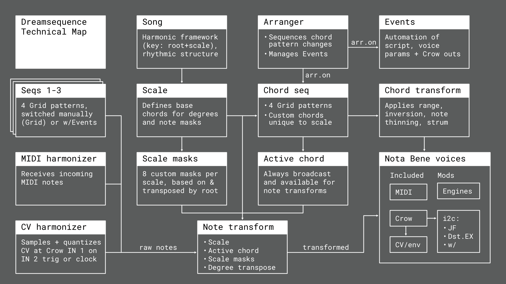
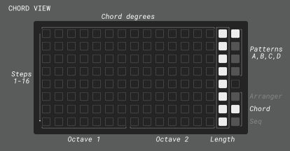

# Dreamsequence

Chord-based sequencer, arpeggiator, and harmonizer for Monome Norns + Grid

Required: Monome Norns (**231114** or later) and Grid (16x8 or 16x16)

Optional: Supports MIDI and Crow by default. Installation of additional [NB voices](https://llllllll.co/t/n-b-et-al-v0-1/60374/156?u=modularbeat) is highly recommended!

[Dreamsequence vids on YouTube](https://www.youtube.com/playlist?list=PL8o_RorYCue6FsMgpDQdhVTmcXPQPBxQW)

---

# Intro

Dreamsequence is a script for theory-informed musical composition and performance with Norns + Grid.

Key features include:

- Degree-based chord sequencer with performance controls for voicing and strumming
- Quick selection of scale-appropriate chords, plus custom chord editor
- Three sequencers configurable for mono, poly, kit, arp, and hybrid modes
- MIDI/CV Harmonizers to transform incoming notes/voltages into new sequences
- Eight custom scale masks for each song scale
- Support for up to six Nota Bene (NB) voices, or merging of sequences to a single voice
- Song Arranger to build fixed-length or looping compositions from chord patterns
- Events to change any script or voice parameter, plus control over CV gear via Crow
- Independent division and swing settings for sequences and Crow clock output
- Algorithmic chord and sequence pattern generation

Dreamsequence is designed to be approachable for people of all musical backgrounds. After learning a few basics, sketching out a new song takes just a few minutes.

If you have feedback, questions, or creations to share, join the conversation at [https://llllllll.co/t/dreamsequence](https://llllllll.co/t/dreamsequence)

Cheers,
Dan

--- 

# Contents

- [Overview](https://github.com/dstroud/dreamsequence/blob/main/README.md#technical-overview)
- [Grid interface](https://github.com/dstroud/dreamsequence/blob/main/README.md#grid-interface)
- [Norns interface](https://github.com/dstroud/dreamsequence/blob/main/README.md#norns-interface)
- [Preferences](https://github.com/dstroud/dreamsequence/blob/main/README.md#preferences)
- [Crow](https://github.com/dstroud/dreamsequence/blob/main/README.md#crow)
- [Changelog](https://github.com/dstroud/dreamsequence/blob/main/README.md#changelog)

# Overview

This Overview will explain how the components that make up Dreamsequence operate together. It's a bit technical and isn't required knowledge to enjoy the script, so feel free to skim the [Grid interface](https://github.com/dstroud/dreamsequence/blob/main/README.md#grid-interface) and [Norns interface](https://github.com/dstroud/dreamsequence/blob/main/README.md#norns-interface) documentation if you want to explore the script at your own pace. Don't forget to [install some NB voice mods](https://llllllll.co/t/n-b-et-al-v0-1/60374/156?u=modularbeat) if you're not using just MIDI/Crow!

> **_NOTE:_** Dreamsequence supports saving/loading of your song through the system PARAMETERS>>PSET menu but you should expect these saves to break when doing updates. I'll do my best to notify of breaking changes in patch notes, but things will be missed and I recommend you wrap up any work before updating.
>

### Chord sequencer
*Grid-based chord pattern sequencer*
- The chord sequencer broadcasts the "active" chord which allows the downstream sequencers and harmonizers to avail themselves of chord-based note transformations.
- Optionally, the active chord can shaped with various parameters (voicing, inversion, note-thinning, strumming) and played directly.
- Patterns entered on Grid are references to chord degrees (I-VII) of the song key (determined by the `Tonic` and `Scale` parameters in the SONG view). This means that the available chords are always appropriate for the song's harmonic framework and adapt to key changes.
- In addition to triads, alternate chord types and user-defined chords are available.
- 4 chord patterns (A, B, C, D) can be saved and switched between manually or with the Arranger.
- See the [Chord Grid interface](https://github.com/dstroud/dreamsequence/blob/main/README.md#chord-grid-interface) and [Chord menu](https://github.com/dstroud/dreamsequence/blob/main/README.md#chord-menu) documentation for details.

### Sequencers 1-3
*Three Grid-based pattern sequencers/arpeggiators*
- Seqs 1-3 can be configured as step sequencers, chord-based arpeggiators, or various hybrids. Sequences may be monophonic or polyphonic.
- Each column on the Grid pattern represents a note, which can be transformed per the `NOTE` parameter. These transformations include playing notes from the active chord, the song scale, the chromatic scale, a fixed drum kit scale, or custom scale masks.
- See the [Seq Grid interface](https://github.com/dstroud/dreamsequence/blob/main/README.md#seq-grid-interface) and [Seq menu](https://github.com/dstroud/dreamsequence/blob/main/README.md#seq-menu) documentation for details.

### MIDI Harmonizer
*MIDI note transformer suitable for chords, sequences, and arpeggios*
- Transforms incoming MIDI to play notes from the selected chord, scale, etc...
- Examples:
  - Turn a synced step sequencer into a chord-aware secondary arpeggio, melody, bassline, etc...
  - Pass a drum pad/sequencer to trigger virtual percussion voices.
  - Improvise with a MIDI controller during live/recorded performances.
  - Use a looping MIDI clip from a synced DAW for off-grid timing.
- See the [MIDI Harmonizer menu](https://github.com/dstroud/dreamsequence/blob/main/README.md#midi-harmonizer-menu) documentation for details (no Grid interface).

### CV Harmonizer
*Sample and hold + quantizer/transformer (requires Crow)*
- A trigger received at Crow input 2 will sample the voltage at input 1 and use this to play a note using a number of transformation options.
- Alternatively, clocked voltage sampling can be scheduled using the `Trigger` setting.
- Examples:
  - Process CV from a eurorack sequencer then send it back out via Crow outputs.
  - Turn LFOs, function generators, S&H modules, etc... into sequencers.
  - Use trigger/clock/voltage sources for novel sequence timing or to inject chaos into a merged sequence.
- See the [CV Harmonizer menu](https://github.com/dstroud/dreamsequence/blob/main/README.md#cv-harmonizer-menu) documentation for details (no Grid interface).

### Arranger
*Chord pattern arranger and Events manager for automation*
- Sequences playback of chord patterns (A, B, C, D) and is the entry point to the Events Editor.
- Events set, increment, randomize, or prompt parameters to "wander" throughout an arrangement, with clamping or wrapping of value ranges and probability control. Events can be used like rudimentary DAWesque automation lanes or they can be used more sparingly to reconfigure your patch at certain key points in your arrangement. Events can also be used to control NB voices, directly output triggers/gates/CV via Crow, and send MIDI bank/program changes to connected devices.
- See the [Arranger Grid interface](https://github.com/dstroud/dreamsequence/blob/main/README.md#arranger-grid-interface) and [Events Grid interface](https://github.com/dstroud/dreamsequence/blob/main/README.md#events-grid-interface) documentation for details.

---

# Grid interface

### Chord Grid interface

The Chord view is used to program chord patterns A-D.

- The playhead moves from top to bottom and sequence length is set using column 15. On 16x8 Grids, E1 can be used to scroll up and down the full 16-step pattern.

- Chords are selected using columns 1-14 which represent chord degrees I-VII across two octaves. Pressing and holding a key will display the corresponding chord name on Norns' screen. At that point, chord variants can be selected using E3.

- The Chord Editor allows defining custom chords. It is accessed by holding a chord key and pressing K3. In the Chord Editor, the two bottom rows represent note intervals across two stacked octaves. The bottom left key is the root note of the selected chord degree, with pitch increasing as you move to the right. After 12 semitones, the progression of intervals moves up a row. Use E3 to select from available chords or enter your own by touching the keys on Grid. The chord can be previewed with K2 (make sure to select a `Voice` option in the Chord menu). Note that not all chords will be recognized, in which case the resulting chord name will be the root note followed by an asterisk, e.g. "C*".

- Rows 1-4 of the rightmost column represent 4 chord patterns: A, B, C, D.
  - Tapping a pattern will disable the Arranger and cue that pattern to play once the current pattern is completed.
  - While stopped/paused, double-tapping a pattern will disable the Arranger and immediately jump to that pattern.
  - Holding one pattern and tapping on another will copy and paste chords from the held pattern without causing the pattern/cue to change.

- The last three keys on the bottom of the rightmost column switch between Arranger, Chord, and Seq views.
  - Holding the Chord view key enables alternate functions:
    - E1 rotates the entire pattern.
    - E2 rotates the looped portion of the pattern.
    - E3 shifts the pattern left or right an octave, with wrapping.
    - K2 generates a new chord pattern and also randomizes some related parameters like scale, root, and tempo.
    - Holding the Chord+Seq view keys together enables K2 to generate both a new chord and Seq pattern.

---
### Seq Grid interface

The Sequence view is used to program notes into the 3 pattern sequencers.

- One sequencer and one pattern can be edited at a time. Use the matrix at the upper right of Grid to select a Seq and pattern to edit/play.

- To change which pattern is playing, tap it. The change can be immediate or quantized depending on the `Change` parameter. Holding one pattern and tapping on another will copy and paste without causing the pattern to change.
  >IMPORTANT: It is possible to change the patterns of multiple sequencers at once, but it is critical to do so with a near-simultaneous press of all keys. If pattern keys are pressed sequentially with even a small amount of hesitation, that gesture will be interpreted as a copy and paste! Be sure to practice this if you intend to do this in a performance setting.

- Each column represents a different note pitch, determined by the `Notes` menu.

- The playhead moves from top to bottom and sequence length is set using column 15. On 16x8 Grids, E1 can be used to scroll up and down the full 16-step pattern. After completing the sequence, the playhead will reset to the beginning and wait to start playback again based on the `Start` parameter.

- The last three keys on the bottom of the rightmost column switch between Arranger, Chord, and Seq views.
  - Holding the Seq view key enables alternate functions:
    - E1 rotates the entire pattern.
    - E2 rotates the looped portion of the pattern.
    - E3 shifts the pattern left one note position, with wrapping.
    - K2 generates a new pattern.
    - Holding the Chord+Seq view keys together enables K2 to generate both a new chord and Seq pattern.
    - K3 accesses the Scale Mask Editor, which allows the customization of 8 scale masks available to Seqs 1-3 and Harmonizers via the `Notes` menu. Use E2 or column 16 on Grid to select row 1-8, representing each custom mask. E3 may be used to select from a menu of predefined scales, or a custom mask may be created with Grid where each column is a semitone interval relative to the song `Root`. In-scale intervals are highlighted, but it's possible to select out-of-scale intervals, too.

---
### Arranger Grid interface

The Arranger view is used to linearly sequence chord patterns and access the Events Editor. The playhead moves from left to right with each increment being a "segment".

- Rows 1-4 correspond to chord patterns A-D. The Arranger length automatically resizes to the rightmost set pattern and any gaps in the sequence are filled in lighter colors to indicate that the previous chord pattern will be sustained. If the first segment isn't filled, it will default to pattern A or it will grab the last populated pattern (since the Arranger is loopable).

- Row 5 is the Arranger timeline which illuminates segments containing one or more events. Holding down a key on the Arranger timeline will enable alternate functions:
  - E3 shifts the selected segment and subsequent segments to the right or left depending on the direction of rotation.
  - K2 will cue the playhead to jump to the selected segment after the current segment is finished.
  - K3 enters the Events Editor view (see next section).
  - Holding a segment on the timeline and tapping on another will copy and paste events from the held segment. You can also hold a segment and tap rows 1-4 to set a pattern and paste events at the same time.

- Grid keys on the bottom left enable or disable the Arranger and Looping, respectively.

- Page keys 1-4 jump the Arranger view in 16-segment chunks (scrolling can also be done incrementally with E1). Note that the arranger view does not follow the playhead off-screen. In that case, a blinking LED will indicate which of the 4 pages the playhead is at. Tap to jump to its position.
 
- The last three keys on the bottom of the rightmost column switch between Arranger, Chord, and Seq views. 

---
### Events Grid interface

The Events Editor view is used to schedule automation of parameter changes and functions at certain points in the Arrangement. Events will be ignored when the Arranger is disabled.

- The view is entered by holding down a segment on the Arranger timeline (row 5) then pressing K3. Think of it as zooming in on that segment (and the chord pattern (A-D) active there).

- Upon entering the editor, Grid displays a view of all events in the selected Arranger segment, where events fire one row/step at a time, left-to-right.
  - Column 16 on the right shows the length of the chord pattern enabled for this Arranger segment. This can not be changed here.
  - Rows 1-16 correspond to steps in the chord pattern.
  - Columns 1-15 are event "lanes" that typically will be used to store one type of event at a time (e.g. tempo changes in lane 1, scale changes in lane 2, etc...). As the chord sequencer advances to a new step, any events on that step fire, left-to-right, just before the chord is played.

- Dreamsequence will help keep track of which events are stored in which lanes, across all segments of the arranger. On Norns' screen, glyphs indicate which lanes are empty (□), contain a single type of event(⊡), or multiple types of events(☰). Selecting a lane with E3 will show the last edited event type in that lane.

- To create/edit an event, tap a position on Grid and use E2/E3 to configure. To undo changes made to an event, just tap the illuminated event on Grid and it will revert to the saved state so you can exit with K3.

- Holding one event and tapping on one or more slots will copy and paste the settings from the held event- this can also be used to paste an empty event over a populated one, effectively deleting it.

---

# Norns interface

## Norns keys and encoders

- Key 1 (K1): Alt
  - Tap quickly to access System menus.
  - In standard views (SONG, CHORD, SEQ, etc...), hold K1 to defer any edits made with E3 until the key is released. This is useful for making jumps from one value to another without applying intermediate values. It's also possible to fire multiple edits simultaneously, even across views.
  - In standard views, hold K1 and tap K3 to toggle the `Sync views` setting.
  - In the Events Editor view, hold K1 to access the quick actions menu. Select an option with K3 and release K1 to fire.

- Key 2 (K2): Pause/Stop(2x)
	- When using Norns' internal clock, K2 will pause playback on a single press and stop on a second press.
	- Pausing is only available when using the internal clock source. For all other clock sources, K2 will initiate a full stop.
	- Stopping will reset the chord pattern position. If the Arranger is enabled, its position will also be reset. If the Arranger is disabled, it can be reset with a third tap of K2.
  - Under certain conditions, alternate functions are enabled for K2 and will be shown at the bottom of the screen.

- Key 3 (K3): Play
	- Default K3 behavior is to start playback.
   	- When using Norns' internal clock source, K3 continues/resumes after pausing. This will also send out MIDI Song Position Pointer (SPP) depending on the MIDI port settings in PARAMETERS>>EDIT>>PREFERENCES. [See preferences](https://github.com/dstroud/dreamsequence/blob/main/README.md#preferences) documentation. 
  - Under certain conditions, alternate functions are enabled for K3 and will be shown at the bottom of the screen.

- Encoder 1 (E1): Scroll Grid
  - For 16x8 Grids, scrolls the Chord and Seq pattern views up and down (8 steps of 16 shown at a time).
  - For all Grids, scrolls the Arranger view along its length (16 of 64 segments are shown at a time.)
  - While holding Chord or Seq Grid view keys (last two keys on the rightmost column): shift the entire active pattern up or down.

- Encoder 2 (E2): Select menu
  - Scrolls or changes focus of selected menu/UI element.
  - Under certain conditions, alternate functions are enabled and will be shown on screen.

- Encoder 3 (E3): Edit menu
  - Changes the value of the selected menu/UI element, including changing the active view on top level menus.
  - Under certain conditions, alternate functions are enabled and will be shown on screen.

## Norns screen

Dreamsequence has seven primary views, each containing a list of menus. Scrolling is done with E2 and values are changed with E3. To change views, use E2 to scroll up to the view's name (SONG in the example above) and change it using E3. On the right is a modular dashboard that can be reconfigured via `PARAMETERS>>EDIT>>PREFERENCES>>Dash 1-4`.

--------------------------------------------------------------------------------
 
### Metro T+ dashboard, 

- On the left, transport status is displayed. This glyph also acts as a metronome, blinking in time with song tempo. The first beat of a new measure is emphasized with a darker glyph. The default time signature is 4/4 and can be changed using `SONG>>Beats per bar/Beat length`.
- On the right, the elapsed play time is displayed. To instead view the estimated time remaining in the arrangement, choose the "Metro T-" option in preferences.

--------------------------------------------------------------------------------

### Arranger chart

- Module elements will be dimmed when the Arranger is disabled.
- The number shown on the left is the active Arranger position/segment. If the Arranger is syncing (waiting for the in-progress chord pattern to complete before entering the arrangement), the upcoming segment will appear with a "→" symbol in front.
- To the right, a symbol will indicate if looping is enabled. When on the last segment of the arranger, this symbol will flash to indicate that the arrangement is about to end or pulse to indicate that it is about to loop.
- The chart is a visual representation of the current and next few arrangement segments, showing patterns (A-D), with rows corresponding to those on the Arranger Grid view. One advantage this dashboard has over Grid is that it gives a preview of upcoming segment/chord pattern lengths, which may differ from pattern to pattern.

--------------------------------------------------------------------------------

### Chord progress

- The letter shown is the current active chord pattern (A-D).
- The progress bar is a visual representation of how many steps are in this pattern (dark gray), and the current pattern position (off-white).

--------------------------------------------------------------------------------

### Chord name

- The name of the active chord. If a custom chord has been created that isn't recognized, the root note of the selected chord degree will be shown with an asterisk (e.g. "D*").
- An alternative module with a visual keyboard is available called "Chord kbd".
    
--------------------------------------------------------------------------------

### Menus

The left portion of the Norns screen displays one of the following views and associated menu items:
  - SONG <> CHORD <> SEQ 1 <> SEQ 2 <> SEQ 3 <> MIDI _(Harmonizer)_<> CV _(Harmonizer)_
 
To navigate between pages, use E2 to scroll to the top of the list of menu items until the page name is highlighted, then use E3 to change the page.

To edit a menu item, simply scroll down the list using E2 and change its value using E3. < and > symbols will appear when at the end of the range of possible values. Descriptions of each page and menu options follow.

> **_TIP:_** Hold K1 while editing menus items to defer applying those changes until K1 is released. For example, if you want to switch voices while playback is ongoing, this lets you switch directly to the desired voice without needlessly sending notes to all the intermediate voices. You can accumulate a number of edits, across views, and fire them all at once.

#### SONG menu

- Tonic: The "home note" of the song, with global transposition of +/- 12 semitones.

- Scale: The scale used to generate the palette of available chords. Select from 9 scales: Major, Natural Minor, Harmonic Minor, Melodic Minor, Dorian, Phrygian, Lydian, Mixolydian, Locrian.

- Tempo: Sets the Norns system clock tempo in BPM.

- Beats per bar: Time signature numerator. Used to determine the current measure, for metronome, and to sync MIDI devices using "pattern" mode (K3>>PARAMETERS>>EDIT>>PREFERENCES MIDI CLOCK OUT). Can only be changed when transport is stopped.

- Beats length: Time signature denominator. Used to determine the current measure, for metronome, and to sync MIDI devices using "pattern" mode (K3>>PARAMETERS>>EDIT>>PREFERENCES MIDI CLOCK OUT). Can only be changed when transport is stopped.
 
- Crow outs: Outs 1-3 have options for "Off", "CV", "Env", and "Events". Out 4 also includes Dreamsequence's custom Crow clock out option. Unlike the system Crow clock, this clock only runs when transport is playing, and has an option for swing. For best results, make sure the system Crow clock is disabled in PARAMETERS>>CLOCK. For more information, see [Crow](https://github.com/dstroud/dreamsequence/blob/main/README.md#crow) documentation.
  
- Crow clk: Frequency of the pulses from Crow out port 4. Frequency is conveyed as fractions of a measure, with Pulses Per Quarter Note (PPQN) in parenthesis.

- Crow swing: Amount of swing applied to the outgoing Crow clock. 50% is 0 swing and 99% is the maximum amount.

- Dedupe <: This enables and sets the deduplication threshold for merging sequences to a single voice. This can be particularly helpful when merging sequences from different sources (say combining harmonizer with chords). Rather than trying to send the same note twice (potentially resulting in truncated notes or phase cancellation issues), this will let the initial note pass and filter out the second note if it arrives within the specified period of time.

- C-gen: Which algorithm is used for generating _Chord_ patterns. The default value picks an algorithm randomly.

- S-gen: Which algorithm is used for generating _Seq_ patterns. The default value picks an algorithm randomly.

#### CHORD menu

- Voice: Where the output of the chord sequence is sent for playback. Default options include Crow and MIDI ports, but additional synths and devices are supported by installing [NB voice mods](https://llllllll.co/t/n-b-et-al-v0-1/60374).

- Channel: This menu item only appears when a MIDI port is selected as a voice (or when K1 is held).

- Octave: Shifts output from -4 to +4 octaves from default. Note that this offset is not the same as MIDI octaves. In the key of C, the default value of 0 will result in chords ranging with root notes ranging from C2 to B3.

- Range: Expands or shrinks the chord's upper pitch range, conveyed as number of notes/tones. The default value of "Chord" dynamically adjusts the range depending on the type of chord; triads will have a range of 3, 7ths will have a range of 4, 9ths will have a range of 5, etc... Manually selecting a specific value will add or remove notes so that every chord plays with the same number of notes. This can be helpful when you want a consistent strum pattern across chords that have varying numbers of notes.

- Max notes: Applied after Range has been set, this option limits the number of notes in the chord using a note thinning algorithm. The algorithm prioritizes the first and last notes in the chord, after which the intermediate notes are thinned out and evenly distributed. The resulting chord voicing depends on Range, Max notes, and Inversion. It's possible to end up with some false chords like the same note repeated across multiple octaves. The default value of "Range" will follow the lead of the `Range` option setting, having no effect on the chord.
 
- Inversion: Incrementally shifts the lowest note up an octave so that 1 = first inversion, 2 = second inversion, etc... At multiples of the chord's Range/Max notes, this will effectively transpose the chord up an octave.

- Strum: Determines if the chord's notes will play all at once (Off), or strum notes in one of two directions (Low-high or High-low).

- Strum length: Length of the strum as a fraction of the chord Step length. The timing of the individual notes is adaptive, depending on the number of notes being strummed.

- Strum curve: Bipolar control (-100% to +100%) over note timing where negative values will cause note timing to slow down over time and positive values will cause note timing to speed up over time. A value of 0% will result in linear timing.

- Step length: The length of each step/row in the chord pattern, relative to 1 measure. Values ending in T are tuplets.

- Duration: Chord note duration relative to 1 measure. Values ending in T are tuplets. The first option, "Step" will always adjust note length to match step length.

- Swing: Amount of swing applied. 50% is 0 swing and 99% is the maximum swing.

- Dynamics: Volume or amplitude of voice.

- Ramp: Bipolar control (-100% to +100%) of the dynamics value for each note. When Strum is off, this will change the dynamic balance of low and high pitched notes in the chord. When strumming, negative values will lower dynamics over time and positive values will increase dynamics over time.
 
#### SEQ 1-3 menus

- Voice: Where the output of this sequence is sent for playback. Default options include Crow and MIDI ports, but additional synths and devices are supported by installing [NB voice mods](https://llllllll.co/t/n-b-et-al-v0-1/60374).
  
- Channel: This menu item only appears when a MIDI port is selected as a voice (or when K1 is held).

- Notes: Determines how the sequence entered on Grid is interpreted in terms of note pitch.

  
  
  - Triad: Columns 1-3 map to notes 1-3 from the active chord degree's triad, ignoring any configured custom chords. Columns 4-6 play the same notes one octave up, etc..

  - Chord raw: Each column plays a note from the active chord, sequentially. One-octave chords will repeat one octave higher and two-octave chords will repeat two octaves higher. For some chords, this can result in a large jump in pitch.
	
  - Chord extd.: Each column plays a note from the active chord, but two-octave chords may have some notes doubled in the upper octave in order to have a smoother transition to the transposed chord.

  - Chord dense: Each column plays a note from the active chord but notes in the second octave will be transposed down an octave and the resulting pitches will be ordered from lowest to highest. This will deduplicate any resulting notes from the same pitch class.

    > **_NOTE:_** When not using custom chords, all of the above options will result in the same notes. Similarly, if the custom chord contains intervals within 1 octave of root, Chord raw/extd./dense will all result in the same notes.

  - Scale: Columns 1-7 play notes from the scale selected in `SONG>>Scale`, columns 8 and up play the same notes one octave higher.

  - Scale+tr.: Columns 1-7 play notes from the scale selected in `SONG>>Scale` and a diatonic transposition is applied based on the active chord degree. Columns 8-12 play the same notes one octave higher. In C Major: columns 1-7 would be C, D, E, F, G, A, B for degree I and D, E, F, G, A, B, C for degree ii.
  
  - Chromatic: Columns 1-12 play chromatic semitones with the starting note determined by `Song>>Tonic`

  - Chromatic+tr: Columns 1-12 play chromatic semitones transposed by the root note of the selected chord degree. In C Major, columns 1-6 would output C, C#, D, D#, E, F for degree I and D, D#, E, F, F#, G for degree ii.

  - Kit: Outputs chromatic semitones, beginning with C, no matter the song's key. Typically used to trigger notes on a drum machine or sampler, but can also be used for static pattern sequencing.

  - Mask 1-8: Custom scale masks that can be edited by holding down the Seq Grid key (column 8, row 8) and pressing K3 to enter the Mask Editor. These custom masks exist at the `SONG>>Scale` level. In other words `SONG>>Scale: Major` contains 8 custom masks which will change when switching to `SONG>>Scale: Natural Minor`. By default, Dreamsequence contains one example custom mask (Mask 1) for each `SONG>>Scale`. Custom Masks will be saved along with a song preset but can also be saved as global defaults, available when creating a new song, via `SYSTEM>>PARAMETERS>>PREFERENCES>>Save masks`.

  - Mask 1-8+tr: Custom scale masks transposed within the scale by the active chord degree. This works just like the diatonic transposition in the Mode+tr option, but can produce curious results when the mask is not heptatonic.

  - Grid: This determines if Grid is configured for monophonic sequencing, or note pools/polyphonic sequencing. It works in conjunction with the `Polyphony` option to determine which notes (and how many of them) to play.
    - Mono: Only one note can be enabled per step/row at a time. If multiple notes appear on a step, having been entered while in a different mode, they will still appear, but only the lowest-pitched note will play.
	  - Pool L→: Multiple notes can be enabled per step, and will play from left to right.
	  - Pool ←R: Multiple notes can be enabled per step, and will play from right to left.
	  - Pool Random: Multiple notes can be enabled per step, and will play in random order.

  - Polyphony: The number of notes that will actually be sent to the voice. Combined with `Grid`, this can be used to play the lowest, the highest, or randomly-selected notes from a "pool" of options. This is useful to create voicing or pattern variation. When `Grid` is Mono, this setting is ignored and only one note will sound.
  
- Octave: Shifts pitch output from -4 to +4 octaves.

- Step length: The length of each step/row in the Seq pattern, relative to 1 measure. Values ending in T are tuplets.

- Duration: Note duration relative to 1 measure. Values ending in T are tuplets. The first option, "Step" will always adjust note length to match step length.

- Swing: Amount of swing timing applied to upbeats. 50% is has no swing and 99% is the maximum.
  
- Accent: Bipolar modulation of note dynamics on upbeats.
  
- Dynamics: Volume/velocity/amplitude of voice, from 1-100%.

- Probability: Probability of note playing vs. being muted.

- Start and Reset menus: The sequence always tries to play until completion, at which point the playhead resets to the beginning and is ready to start again as soon as it receives the signal to do so. These menu options determine what can send that signal to start and what can force a restart before the end of the sequence.

  The following example shows how the same 8-note sequence can be reinterpreted by changing `Start` and `Reset` options (chords shown below sequence).
	
  

  - Start: Condition for starting the sequence once it has completed.
    - Loop: As soon as the sequence ends, it will start itself in a loop.
    - Every step: Starts the sequence when the chord sequencer advances a step.
    - Chord steps: Starts the sequence when the chord sequencer advances to a step containing a chord.
	  - Empty steps: Starts the sequence when the chord sequencer advances to an empty step.
	  - Measure: Starts the sequence when advancing to a new measure (see `Song>>Beats per bar/Beat length`).
    - Off/trigger: Sequence only starts when the `Trigger start` param is triggered in one of two ways:
	    - `Seq n>>Trigger start` parameter, which can be called by external devices using MIDI/OSC PMAP. 
	    - `Seq n>>Pattern>>Trigger start` event.

  - Reset: While sequences naturally reset upon completion, they can also to interrupted and an immediate reset can be forced. Depending on when the reset occurs, this can prevent the sequence from reaching its end, keeping it in a suspended loop. Note: patterns are also reset when transport is stopped.
    - Every step: Resets the sequence when the chord sequencer advances a step.
    - Chord steps: Resets the sequence when the chord sequencer advances to a step containing a chord.
	  - Empty steps: Resets the sequence when the chord sequencer advances to an empty step.
	  - Measure: Resets the sequence when advancing to a new measure (see `Song>>Beats per bar/Beat length`).
    - Off/trigger: Sequence only resets when the `Trigger reset` param is triggered in one of two ways:
	    - `Seq n>>Trigger reset` parameter, which can be called by external devices using MIDI/OSC PMAP. 
	    - `Seq n>>Pattern>>Trigger reset` event.
	   
	> **_NOTE:_** Triggering the `Trigger start/reset` parameters/events can be done in combination with any of the selections above.
	> 
 
 - Change: When switching sequence patterns using Grid, this option determines whether the change is immediate or quantized to occur on the next loop or reset. Pattern changes initiated by events will happen immediately.

#### MIDI (Harmonizer) menu

- Voice: Where the output of the harmonizer is sent for playback. Default options include Crow and MIDI ports, but additional synths and devices are supported by installing [NB voice mods](https://llllllll.co/t/n-b-et-al-v0-1/60374).
  
- Channel: This menu item only appears when a MIDI port is selected as a voice (or when K1 is held).

- Notes: Determines how incoming MIDI notes are transformed into new notes by the harmonizer. This works similarly to Seqs 1-3 except incoming MIDI note values are used rather than columns on Grid. Column 1 == C1, column 2 == C#1, column 3 == D1, etc...
    
  

  - Triad: Notes C1-D1 map to notes 1-3 from the active chord degree's triad, even if a custom chord has been configured. Notes D#1-F1 play the same notes one octave up, etc..
	
  - Chord raw: Each incoming MIDI note plays a note from the active chord, sequentially. One-octave chords will repeat one octave higher and two-octave chords will repeat two octaves higher. For some chords, this can result in a large jump in pitch.
	
  - Chord extd.: Each incoming MIDI note plays a note from the active chord, but two-octave chords may have some notes doubled in the upper octave in order to have a smoother transition to the transposed chord.

  - Chord dense: Each incoming MIDI note plays a note from the active chord but notes in the second octave will be transposed down an octave and the resulting pitches will be ordered from lowest to highest. This will deduplicate any resulting notes from the same pitch class.

    > **_NOTE:_** When not using custom chords, all of the above options will result in the same notes. Similarly, if the custom chord contains intervals within 1 octave of root, Chord raw/extd./dense will all result in the same notes.

  - Scale: Plays notes from the scale selected in `SONG>>Scale`.

  - Scale+tr.: Plays notes from the scale selected in `SONG>>Scale` and a diatonic transposition is applied based on the active chord degree. In C Major, incoming notes C1-F#1 would output C, D, E, F, G, A, B for degree I and D, E, F, G, A, B, C for degree ii.
  
  - Chromatic: Plays chromatic semitones, with the starting note determined by `Song>>Tonic`.

  - Chromatic+tr: Plays chromatic semitones transposed by the root note of the selected chord degree. In C Major, incoming notes C1-F1 would output C, C#, D, D#, E, F for degree I and D, D#, E, F, F#, G for degree ii.
  
  - Kit: Uses the same pitch of incoming note for the outgoing note. This is typically used to trigger notes on a drum machine or sampler, but can also be used to play voices directly (although note duration and velocity are determined by their respective menus, not by the incoming note).

  - Mask 1-8: Custom scale masks that can be edited by holding down the Seq Grid key (column 8, row 8) and pressing K3 to enter the Mask Editor. These custom masks exist at the `SONG>>Scale` level. In other words `SONG>>Scale: Major` contains 8 custom masks which will change when switching to `SONG>>Scale: Natural Minor`. By default, Dreamsequence contains one example custom mask (Mask 1) for each `SONG>>Scale`. Custom Masks will be saved along with a song preset but can also be saved as global defaults, available when creating a new song, via `SYSTEM>>PARAMETERS>>PREFERENCES>>Save masks`.

  - Mask 1-8+tr: Custom scale masks transposed within the scale by the active chord degree. This works just like the diatonic transposition in the Mode+tr option, but can produce curious results when the mask is not heptatonic.

- Port in: MIDI port monitored for incoming MIDI notes to transform.

- Octave: Shifts output from -4 to +4 octaves.

- Duration: Note duration relative to 1 measure. Values ending in T are tuplets. The first option, "Step" will always adjust note length to match step length.
  
- Dynamics: Volume/velocity/amplitude of voice, from 1-100%.

#### CV (Harmonizer) menu

- Voice: Where the output of the CV harmonizer is sent for playback. Default options include Crow and MIDI ports, but additional synths and devices are supported by installing [NB voice mods](https://llllllll.co/t/n-b-et-al-v0-1/60374).

- Trigger: When set to "Crow IN 2", this option will sample the voltage at Crow input 1 and immediately play a note. Other settings may be used to automatically sample the voltage at regular divisions of the clock. Note that very fast rates are likely to result in erratic notes if `SONG>>Dedupe` is not set to "Off".

- Channel: This menu item only appears when a MIDI port is selected as a voice (or when K1 is held).

- Notes: Determines how voltage received on Crow input 1 is transformed into notes by the harmonizer. This works similarly to Seqs 1-3 except incoming voltage is first quantized to 1v/octave and the resulting semitone is used to play notes.

  
  
  - Triad: voltage of 0v, 1/12v, 2/12v map to notes 1-3 from the active chord degree's triad, even if a custom chord has been configured. Voltage of 3/12v, 4/12v, 5/12v play the same notes one octave up, etc..

  - Chord raw: Each quantized note plays a note from the active chord, sequentially. One-octave chords will repeat one octave higher and two-octave chords will repeat two octaves higher. For some chords, this can result in a large jump in pitch.
	
  - Chord extd.: Each quantized note plays a note from the active chord, but two-octave chords may have some notes doubled in the upper octave in order to have a smoother transition to the transposed chord.

  - Chord dense: Each quantized note plays a note from the active chord but notes in the second octave will be transposed down an octave and the resulting pitches will be ordered from lowest to highest. This will deduplicate any resulting notes from the same pitch class.

    > **_NOTE:_** When not using custom chords, all of the above options will result in the same notes. Similarly, if the custom chord contains intervals within 1 octave of root, Chord raw/extd./dense will all result in the same notes.

  - Scale: Plays notes from the scale selected in `SONG>>Scale`.

  - Scale+tr.: Plays notes from the scale selected in `SONG>>Scale` and a diatonic transposition is applied based on the active chord degree. In C Major, incoming voltage of 0/12v, 1/12v, 2/12v would output C, D, E... for degree I and D, E, F... for degree ii.

  - Chromatic: Plays chromatic semitones, with the starting note determined by `Song>>Tonic`.

  - Chromatic+tr: Plays chromatic semitones transposed by the root note of the selected chord degree. In C Major, incoming voltage of 0/12v, 1/12v, 2/12v would output C, C#, D... for degree I and D, D#, E... for degree ii.
  
  - Kit: Outputs chromatic semitones, beginning with C, no matter the song's key. Typically used to trigger notes on a drum machine or sampler, but can also be used for static pattern sequencing.

  - Mask 1-8: Custom scale masks that can be edited by holding down the Seq Grid key (column 8, row 8) and pressing K3 to enter the Mask Editor. These custom masks exist at the `SONG>>Scale` level. In other words `SONG>>Scale: Major` contains 8 custom masks which will change when switching to `SONG>>Scale: Natural Minor`. By default, Dreamsequence contains one example custom mask (Mask 1) for each `SONG>>Scale`. Custom Masks will be saved along with a song preset but can also be saved as global defaults, available when creating a new song, via `SYSTEM>>PARAMETERS>>PREFERENCES>>Save masks`.

  - Mask 1-8+tr: custom scale masks transposed within the scale by the active chord degree. This works just like the diatonic transposition in the Mode+tr option, but can produce curious results when the mask is not heptatonic.
  
- Auto-rest: When on, this option will not repeat the same note within one chord step. This is a useful way of adding rest functionality into analog sequencers that don't support such a feature.

- Octave: shifts output from -4 to +4 octaves.

- Duration: Note duration relative to 1 measure. Values ending in T are tuplets. The first option, "Step" will always adjust note length to match step length.

- Swing: When `Trigger` is not set to "Crow IN 2", this determines the amount of swing timing applied to upbeats when sampling voltage. 50% is has no swing and 99% is the maximum.
    
- Dynamics: Volume/velocity/amplitude of voice, from 1-100%.

---

# Preferences
Global preferences that persist across sessions, set via PARAMETERS>>EDIT>>PREFERENCES, allow Dreamsequence to be customized to your liking.
- Default song: Determines if a preset (PSET) is loaded at script launch.
  - New: Starts with an empty song each time the script is launched.
  - Last PSET: Loads the last-saved PSET on script launch.
  - Template: Loads the template (PSET 00) on script launch.

- Save template: Press K3 to save the current song as a template.
 
- Save masks: Press K3 to save all scale masks in the current song as global scales, available the next time the script starts with `Default>>New` selected.

- Sync views: When on, changing views on Grid will change views on Norns, and vice versa. This setting can also be toggled from within Dreamsequence using K1+K3. Note that the views are not necessarily 1:1 as there are no Grid views for the MIDI and CV harmonizers.

- Notifications: Determines whether notifications pop up at the bottom of the screen, and for how long. Momentary notifications only appear when holding down keys, whereas the other options will appear for a fixed amount of time after the key is released. None of the notifications are essential for use of the script, but they may be helpful to remember what certain keys do and to confirm actions.

- Preview notes: When on, Grid will play notes when pressing chord/seq keys. This only occurs when transport is not playing.

- Dash 1-4: Configures the modules shown in screen dashboard, from top to bottom:
  - Off
  - Arranger chart: Arranger position, loop on/off, and visualization of arranger.
	- Chord name: Readout of active chord.
  - Chord kbd: Keyboard viz of active chord, arranged as one octave.
	- Chord progress: Current chord pattern and progress.
  - Metro T-: Transport state, metronome, and time remaining in arrangement.
  - Metro T+: Transport state, metronome, and elapsed play time.

- Crow pullup: i2c pullup resistors can be set On (default) or Off.

- Voice instances: For NB voices that support multiple instances, this determines how many are created. **__Important: restart Dreamsequence to apply changes.__**
  
- ENC 1-3: Speed of encoders/potentiometers and whether acceleration is enabled.

- MIDI Clock Out: Determines behavior of synced MIDI devices when pausing/continuing:
    - The “song” option will send out MIDI Song Position Pointer (SPP) and Continue messages which should work well for Digital Audio Workstations (DAWs) and linear sequencers.
	- The “pattern” setting will cause Dreamsequence to continue playback and then send a ’start’ message at the beginning of the next measure. This works well for devices that don’t support SPP: drum machines, loopers, Ableton live’s “Session” view, etc…
	- In order for ‘pattern’ mode to work as expected, you must set a time signature via SONG>>Beats per bar/Beat length (time signature numerator and denominator).
 
---

# Crow

Dreamsequence supports using Monome Crow to send and receive CV envelopes, as well as for events that can output triggers, gates, and voltage.

### Inputs
- Crow IN 1: CV will be sampled by the CV Harmonizer to determine outgoing note pitch. Voltage can be be unquantized or quantized. Since small changes in voltage can result in wide ranges in notes, attenuation is recommended.

- Crow IN 2: Triggers rising past 2 volts will sample the CV on Crow IN 1 and send a note from the CV Harmonizer

### Outputs
Outputs are configurable via `Song>> Crow out 1-4`, defaulting to:

- Crow OUT 1 (CV): 1V/oct when a voice is set to "Crow 1" (CV only) or "Crow 1/2" (CV/Env pair).

- Crow OUT 2 (Env): Sends envelope along with CV when a voice is set to "Crow n/2" (CV/Env pair).

- Crow OUT 3 (Events): Reserves output for [Arranger Events](https://github.com/dstroud/dreamsequence/blob/main/README.md#events-view). Technically, Crow events can be sent to any out, but this makes sure that notes are not mistakenly sent to an out intended solely for events.
- Crow OUT 4: Dreamsequence's clock out. Unlike the system Crow clock, this clock only runs when transport is playing, and has an option for swing. For best results, make sure the system Crow clock is disabled in PARAMETERS>>CLOCK.

### Tips

- Tuning: CV output can be automatically tuned to concert pitch (A - 440Hz) using the `tune` parameter in K1>>PARAMETERS>>EDIT>>VOICES>>crow n (cv). To do so, turn down Norns' monitor levels, patch an oscillator to Norns' left input (**MAKE SURE TO ATTENUATE HOT/MODULAR LEVELS DOWN TO LINE LEVEL!**), bypassing VCA, etc..."

- Envelopes: Shapes are adjustable via K1>>PARAMETERS>>EDIT>>VOICES>>crow n (env).
  - For gates, choose attack and release shapes of "now", and sustain of 1.
  - For triggers, choose attack and decay shapes of "now" and sustain of 0.

---

# Changelog

v1.4

 
### Features
- Chord enhancements
  - Scale/degree-appropriate chord variants selectable by holding chord key and using E3 (scale/degree specific)
  - Custom chords editable by holding chord key and pressing K3 to enter editor

- Scale masking
  - Hold Seq view switcher (bottom right Grid key) + K3 to access
  - 8 masks available per song scale
  - Masks selectable from list of scales or customizable with Grid
  - Available to Seqs and MIDI/CV Harmonizers via `Notes` param
  - Can be globally saved via Preferences

- Sequencer (Seq) enhancements
	- 3 concurrent sequencers
	- 4 patterns each w/ copy+paste, instant/quantized switching configurable via `Change` param
	- Polyphonic seq modes
		- `Grid` param determines if Grid is mono or pool/poly, as well as order of note playback
		- `Polyphony` param determines number of notes played per step
  - Pattern shift param (in addition to loop shift)
  - `Notes` param options: kit/drum (chromatic starting from C1), scale masks. Also available for MIDI/CV harmonizers.
  - New `Start`/`Reset` options: Empty steps, Measure, 

- User Interface:
	- Holding K1 while changing menu values defers applying changes until K1 is released
	- Norns and Grid views will be synced by default when `Sync Views` is enabled in Preferences. Can be toggled by holding K1+K3.
	- Holding chord or seq Grid view switcher key and tapping a pattern will toggle muting of chord or seq.
  - `Notifications` preference adjusts or disables pop-up notifications
  - `Preview notes` preferences plays or silences pressed chords/notes while stopped
	- `Enc 1-3`: set encoder speed and acceleration
	- Rotation of full seq pattern or looped portion of pattern (param or destructive via seq key + E1/E2)
	- Pressing K2 when transport is stopped will reset arranger position, even if arranger is disabled
 	- E1 can be used to scroll arranger continuously, in addition to the page jump keys

- Modular dashboard 
	- New options including metronome, chord pattern progress, elapsed play time
	- Configure with PARAMETERS>>EDIT>>PREFERENCES>>Dash 1-4

- Events
	- Events Editor now tracks what event types are saved in each lane/column across the entire arrangement and provides a summary browsable using E2/3. Glyphs indicate lane type:
		- ☐ empty lane
		- ⊡ "single-event" lane containing only type of event
		- ☰ "multi-event" lane containing various types of events
	- Selecting a lane using E2/3 or tapping an empty event slot will show the last-saved event in that lane
	- Holding K1 in the Events Editor brings up a quick actions menu. Select an option with E2/3 and release K1 to perform the action. Currently the only option is to clear all events in the segment.
  - MIDI Bank Select and Program Change events
  - Song>>Arranger>>Next position event can create nonlinear/randomized arrangements. Can also be used to create sub loop (i.e. use segment 1 for song init events then loop from a later segment 2).

- Quality of life
  - Custom MIDI voice with script control over MIDI channel
  - Reworked Grid drawing, use of pulses to indicate low-priority states (looping Arranger, pattern changes, selected events/lanes) and blinking to indicate high-priority state (muted chord/seqs, unsaved events, off-Grid patterns and Arranger position)
  - Pop-up notifications to confirm actions like copy+paste, Arranger enable/disable, etc...

### Changes and FYI
- Will reset `load pset` pref on first launch as compatibility with older psets is broken.
- Rolled back requirements to 231114 for Fates. However, Norns 240221 is required for Ableton Link clock support.
- Dropping MIDI device names and displaying by port # instead. Sorry, they're just too long.
- Default seq `reset` value is now "measure".

### Known issues
- Breaks compatibility with pre-1.4 PSETs
- Seq start/reset triggered by a new measure will occur before events fire
- Time signature (`beats per bar` and `beat length`) can not be changed unless transport is stopped

	

v1.3

	
### Features
- Nota Bene (NB) voice support. MIDI and Crow are supported by default and additional voices can be installed via the following Maiden commands. See [the NB topic on Lines](https://llllllll.co/t/60374) for details.

	Soft synths:

	`;install https://github.com/sixolet/doubledecker`	2-layer synth a la CS-80

	`;install https://github.com/sixolet/emplaitress`	Polyphonic MI Plaits

  `;install https://github.com/dstroud/nb_polyperc`	Norns PolyPerc

	`;install https://github.com/entzmingerc/nb_rudiments`	Rudiments percussion

 	i2c devices:

	`;install https://github.com/sixolet/nb_wsyn`	Whimsical Raps W/synth

	`;install https://github.com/sixolet/nb_jf`	Whimsical Raps Just Friends

	`;install https://github.com/sixolet/nb_ex`	Expert Sleepers Disting EX

	`;install https://github.com/sixolet/nb_ansible`	Monome Ansible
- Swing settings for Chord, Seq, CV harmonizer, and Crow clock out.
- Seq `Accent` param applies a positive or negative dynamics offset to swing steps.
- "Step" duration setting adjusts note duration to always match the step length (Chord and Seq) or Trigger division (CV harmonizer).
- Pressing a Grid pattern key when transport is stopped will play that chord or note.
- Chromatic mapping option added to `Notes` parameter.
- The SONG menu now has settings for configuring Crow's outputs which will result in various CV or CV/Env pair options appearing in Voice parameters. All outs can send CV, Env, and Events while out 4 can also send a Clock pulse when transport is running.
- `Crow events` event category has been created with subcategories for outputs 1-4. There's also a new event "5v 8-steps" event for driving a sequential switch (i.e. Vice Virga) that maybe works with similar devices (0.31v, 0.94v, 1.56v, 2.19v, 2.81v, 3.44v, 4.06v, 4.69v).
- Seq `Probability` param determines probability of note playing vs. being muted.

### Changes and FYI
- Requires Norns 240221
- An event category is created for each NB voice at script launch, allowing script control over each voice's sound. Event verification occurs on .pset load. _WARNING: if a pset is loaded that includes events for a NB voice mod that has since been disabled, those events will be deleted._
- Events now respect controlspec/taper parameter mappings. E.g. Increment/Wander will result in the same values as if performing a parameter change via encoders.
- Chord preload setting is disabled. I’m not sure how necessary this feature was (it was intended to allow jamming on a keyboard into the MIDI/CV harmonizers, even if the notes were hit a little before the chord change). I never really used it and it’s a bit complicated to implement with Lattice so I’m just turning it off for now. LMK if you need this and I can look into bringing it back.
- MIDI device names may be shortened to fit (acronym-based) and will appear alphabetically as if they have an invisible prefix of "MIDI". The numbers at the end are `port.instance` where port is the assigned MIDI port in `system>>devices` and instance is the number of instances of the NB voice (default 1).
- Chord division change events will now occur before the chord plays rather than on the next step.
- Important transport changes (depending on clock source):

  - Internal clock source (preferred)
    - Pressing K2 will immediately pause Dreamsequence and send a stop message out to synced devices.
    - New `MIDI CLOCK OUT` settings are available for each MIDI clock port via `K3>>PARAMETERS>>EDIT>>PREFERENCES` and determine behavior when continuing after pausing. 
      - The “song” option will send out MIDI Song Position Pointer (SPP) and ‘continue’ messages which should work well for things like DAWs.
      - The “pattern” setting will cause Dreamsequence to continue playback and then send a ’start’ message at the beginning of the next measure. This works well for devices that don’t support SPP: drum machines, loopers, Ableton live’s “Session” view, etc…
      - In order for pattern mode to work as expected, you must set a time signature via SONG>>Beats per bar/Beat length (time signature numerator and denominator). Changing the time signature requires a stop and restart, I think.
	
	
  - Link clock source (limited support)
    - The good news: the issue with starting Link from Norns is addressed in update [240221](/t/norns-update-240221/66241)!
    - The bad news: the way the Link issue is being addressed prevents pause/continue from working at all. I’ve raised an [issue](https://github.com/monome/norns/issues/1756) about this and hopefully a solution can be found. For now, K2 or a stop message from a synced device will result in a full stop.
	
  - MIDI clock source
    - K2/K3 are disabled.
    - No pause/continue (full stop/start only).

  - Crow clock source (not supported)

### Known issues

- Breaks compatibility with earlier .psets. May need to clear dust/data/dreamsequence/prefs.data
- At the end of a 1-shot arrangement, a MIDI/Link stop message is sent. This technically occurs at the start of the next measure which may cause synced devices to stop late (Link in particular as there's no latency compensation).
- Live time signature changes probably will break something.

	

v1.2

	
## New Chord menu options:

- Output: Crow is now enabled as an output destination for Chords. For best results, enable a Strum direction or set "Max notes" to 1.

- Range: Expands or shrinks the chord's pitch range, measured in note intervals. An asterisk (*) will appear if this value is less than the "Max notes" parameter, indicating that the value shown here is limiting the number of notes played. Note that a Range of 3 will effectively play 7th chords as triads.

- Max notes: Applied after Range has been set, this parameter limits the number of notes in the chord using a note thinning algorithm. The algorithm prioritizes the first and last notes in the chord, after which the intermediate notes are thinned out and evenly distributed. The resulting chord voicing depends on Range, Max notes, and Inversion. It's possible to end up with some false "chords" like the same note repeated across multiple octaves.

- Strum: Determines if the chord's notes will play all at once (Off), or strum notes in one of two directions (Low-high or High-low).

- Strum length: Length of the strum as a fraction of the chord Step length. The timing of the individual notes is adaptive, depending on the number of notes being strummed.

- Strum curve: Bipolar control (-100% to +100%) over note timing where negative values will cause note timing to slow down over time and positive values will cause note timing to speed up over time. A value of 0% will result in linear timing.

- Ramp: Bipolar control (-100% to +100%) of the Velocity/Amp values for each note. When Strum is off, this will change the dynamic balance of low and high pitched notes in the chord. When strumming, negative values will lower dynamics over time and positive values will raise dynamics over time.

## Breaking changes:

- Chord Spread has been removed. Similar functionality is available using the Range parameter (although higher values are required to achieve the same result). Saved songs with Chord Spread events will probably break on load. Let me know if this is a problem and I’ll work out a patch to address this.

- By default, chords will now play 4 notes rather than Triads playing 3 notes and 7ths playing 4 notes. Triads will simply repeat the root note one octave up. This change was made for the benefit of consistent strum patterns regardless of chord type.	

v1.1

	
# Highlights

- K3 plays, K2 pauses on a single tap and stops on a double tap.

- Saving/ loading via system PARAMETERS>>PSET menu works but saves will break when I do updates.

- A few persistent settings now live in K1>>PARAMETERS>>PREFERENCES.

- "Arp" is now "Seq" and has 3 new options that enable it to operate independently from the chord sequencer in terms of pitch and start/reset synchronization. It can also be controlled via Events and param triggers. It's going to blow your freaking mind, maybe.

- Arranger Events have new settings like probability, range limits, and two new operations that can randomize values or cause them to increment up or down based on a coin-toss.

- Arranger extended from 16 to 64 segments.

-  Crow v4.0.4 support

---

# New features

### Utilities

- Save/load of parameters, patterns, arrangement, and events can be performed through the system PARAMETERS>>PSET menu. Data is stored in /home/we/dust/data/dreamsequence/*pset no*.  

  > **_UH OH:_** SAVES ARE 1000% GOING TO BREAK WHEN FUTURE UPDATES COME OUT. Wrap up your work before updating,  folks!

- Persistent preferences can be set for the following parameters via K1>>PARAMETERS>>EDIT>>PREFERENCES
	- Default pset: Automatically load the last-saved pset (and data) on script launch. 
	- Chords as: Displaying chords names (Gmaj) or as chord degrees (VII). DS 1.1 temporarily has a missing half dim chord symbol, see “ISSUES” section for more info.
	- Crow pullup: On (default) or Off.

- Version checks at system load for Norns and Crow. Crow v4 is cleared for flight and Dreamsequence will reconfigure itself depending on which version is installed.

- Pre-initialization Crow clock settings and Just Friends mode are restored on script exit.

### Seq
- “Arp” has emerged from its chrysalis as “Seq” and is much more flexible (both as a step sequencer and as an arpeggiator). 

- "Notes” menu offers four ways of configuring note mapping:
  - Triad: columns 1-3 map to notes 1-3 from the active chord interpreted as a triad. Columns 4-6 play the same notes one octave up, etc..
  - 7th: columns 1-4 map to notes 1-4 from the active chord interpreted as a 7th chord. Columns 5-8 play the same notes one octave up, etc..
  - Mode+transp.: columns 1-7 play notes from the selected mode and apply a diatonic transposition based on the active chord degree. Columns 8-14 play the same one octave up. Example: In C Major degree I, columns 1-7 would be C, D, E, F, G, A, B. Degree ii would result in D, E, F, G, A, B, C.
  - Mode: columns 1-7 play notes from the selected mode, columns 8-14 play the same one octave up.

- "Start on" menu option. Seq always tries to play until it completes, at which point it loops to be the beginning and is ready to start again as soon as it receives the signal to do so. The "Start on" menu option determines what can send that signal to start:
  - Seq end: as soon as the sequence ends, it will start itself in a loop.
   - Step: start Seq when the chord sequencer advances a step.
   - Chord: start Seq when the chord sequencer advances to a step containing a chord (empty steps are ignored). Useful for turning Seq into a chord strummer, or to layer notes on top of the chord, building alternative chord types and voicings.
   - Cue: start Seq when it receives a "Start" event or the "Start" param is triggered via K1>>PARAMETERS>>EDIT>>SEQ (also MIDI/OSC mappable so this can be called by external sources). 

- “Reset on” menu option. Seq can be forced to reset before its normal end using this setting. Depending on when the reset occurs, this can prevent the sequence from reaching its end, keeping it in a suspended loop.
  - Step: reset Seq when the chord sequencer advances a step.
  - Chord: reset Seq when the chord sequencer advances to a step containing a chord (empty steps are ignored).
  - Stop: reset Seq when the transport is stopped and patterns are reset (not on pause).
  - Can also reset Seq using the "Reset" event or the "Reset" param is triggered via K1>>PARAMETERS>>EDIT>>SEQ (also MIDI/OSC mappable so this can be called by external sources). 
- “Pattern shift” and “Pattern rotate” parameters allow the Seq pattern to be shifted using a menu option (and LFO mod for those so inclined). These also have corresponding events that replace the previous “transpose” event type. Once advantage of these new events is that they have more operation types available to them and can be reset back to their default position whereas the old transposition was not very smart and could only increment by a set amount. The old transpose functionality still remains (holding down the chord or arp grid key and turning E3) if you’re just looking for a way to adjust your patterns in a set-and-forget manner. Not yet available for chord patterns.

- “Pattern length” parameter available via K1>>PARAMETERS>>SEQ allows setting Seq pattern length via PMAP or Event.

### Chord sequencer
  - “Pattern length” parameter available via K1>>PARAMETERS>>CHORD allows setting length of active chord pattern via PMAP or Event.

### Arranger & Events

- Arranger length is extended from 16 segments to 64 segments and can be navigated using the four pagination keys at the bottom of the Grid view.

- Event probability setting in Events Editor determines how likely it is for the event to fire.

- New Event operation types:
  - ‘Random’ operation picks a random value (within range) for the selected event.
  - ‘Wander’ operation increments the current event’s value by either the value as provided or its inverse (determined by a tiny coin-tosser that lives inside Norns!). Example: a ‘Tempo’ event with the Wander operation applied at a value of 5 would mean a tempo of 120 BPM would change to either 115 or 125 when the event fires. 

- Event ‘Limit’ options allow you to set a min and max value range that can either be clamped or wrapped. Clamp = values will stop once they reach the limit. Wrap = values will wrap around once they reach the limit. Example: a value of 8 with a Limit of -10 to 10 incremented by 5 will result in a clamped value of 10 or a wrapped value of -8.

### Quality of life improvements
- Events Editor menus are now broken down into Category and Subcategory.

- Events Editor displays the state of the selected event in the header: New, Edited, or Saved. 

- Transport state indicator displays a flashing play symbol when waiting to sync with an Ableton Link clock, and a flashing pause symbol when waiting to pause until the end of the current chord. Accidental pause can be canceled if you press play before the end of the chord step.

### Clock improvements
- Ableton Link:
  - Sync now uses the ‘link quantum’ parameter in Parameters>>Clock to determine when to start after receiving a start message. 
  - Pause can be performed from Dreamsequence and will be quantized with the chord step length (pausing synced devices as well).
  - Pattern/arranger reset can be performed from Dreamsequence once paused.
  - See ISSUES section for more info on what doesn’t quite work yet.

- MIDI: transport controls now work when syncing to MIDI clock. Pause can be performed from Dreamsequence and will be quantized with the chord step length (sending out a MIDI stop as well, depending on clock config).

  > **_TIP:_** It’s possible to finagle a sort of count-in by sending an external start, stopping on Dreamsequence (K2 2x), then scheduling a clean punch-in on the next beat using K3. This avoids the age-old issue of timing being a little off on the first beat when MIDI devices sync.

### Misc features

- ‘Mod wheel’ menu option and corresponding event for MIDI destinations sends control change 1 messages.
- CV/MIDI harmonizers also have the same 4 “Notes” mapping styles as Seq.

---

# Fixes
- Misconfigured 7th chords have been fixed and chord naming has been much improved due to the tireless work of @dewb who has loaned Dreamsequence a preproduction version MusicUtil to take for a spin :raised_hands:
- Shifting arranger (holding a section of the events strip and turning E3) no longer causes playback to lag. The segment/events shift isn’t applied until the Grid key is released; Grid display is just a visual preview.
- Harmonizer input after script load but before hitting play no longer results in hanging notes.
- Enthusiastic knob twiddling no longer causes playback to lag. Commence enthusement.
- First beat of MIDI clock sync is 1/192nd note faster.
- 1-shot arranger can now be started again from external transport calls after initial run.
- Issue preventing Crow AD envelope parameter from working.
- Disting EX now allows re-triggering of sustained notes.
- Seq generator algorithms won't produce off-grid results.

---
# Changes

- Transport controls have changed. K2 pauses playback on a single press and stops on a second press (stopping resets the active chord pattern and will reset the Arranger if playback is enabled). K3 now starts playback (except when syncing to Link clock— see ISSUES section) and can also cancel a pending pause if you catch it in time.
I know many (most?) scripts put play on K2 so if you are having trouble with this config after spending some time with it, let me know. I’m open to providing a setting to swap K2 and K3 for transport controls. But a hybrid pause/stop button makes a lot more sense than a separate reset button that is like the LAUNCH-NUKES button during live performance

- While transport is playing, it is no longer possible to force the active chord pattern to change by double-tapping a chord pattern key (or tapping the active pattern again). You must stop playback first. It was just an accident waiting to happen.

- Deleting all events now requires holding K2 down until the onscreen countdown completes.

- Current chord pattern position readout (top right on screen) now displays pattern, current step, and pattern length. Example: “B.2/8” means pattern B, step 2 of 8 total. ‘RST’ appears when pattern has been reset.

- Arranger mini dashboard (bottom right on screen) has some tweaks:
	- Loop/1-shot glyph blinks when on the last step of arranger as a heads-up.
	- Interrupting arranger playback (by disabling arranger manually or changing chord patterns, then re-enabling the arranger) will now freeze the interrupted segment in the chart and the segment position readout above will now show the upcoming segment (instead of a kind useless “T-”).
	- The countdown until the arranger resumes now counts backwards through zero because it felt wrong to jump from -1 to 1. IDK.
	- Interrupting arranger playback will now show the remaining time in arrangement upon arranger resume. It doesn’t count the active pattern because it’s technically not part of the arrangement.
	- Special states may appear:
		- RST = arranger reset
		- LP = resuming arranger on last segment which will result in looping to beginning (loop mode)
		- EN = resuming arranger on last segment which will result in arrangement ending (1-shot mode)

- Culled some of the more awful Seq generator algorithms, added a variant ER 2-note with no rests. Added a repeat note check function for the ‘Dual seq’ algo.

---

# Issues
- Half-diminished 7th chords will show a blank rectangle pending the addition of a [new ø glyph](https://github.com/monome/norns/pull/1688#event-9828652834).

- Sending a ludicrous amount of triggers to Crow input 2 for a sustained amount of time can cause Crow to throw nonsensical errors in Maiden and bog down Norns to the point of unresponsiveness until CV cables are unplugged. I haven’t really found this to be an issue in normal usage with either Crow v3.0.1 or v4.0.4, but YMMV.

- Starting Link from K3 is not yet supported due to an issue with Norns clock.link.start() function clobbering running clocks. If anyone smart wants to poke around the C clock code, please reach out so I can explain the issue!

- Latency offset is not yet supported. I’ve worked out a nifty solution for this but it requires changes to Dreamsequence’s clocking architecture and is not a *high* priority while the Link clock issue exists.

- Quantized stop may tick over into the first beat of the next measure on synced devices. This can be addressed with MIDI clock offset in DAWs but a solution for Link requires further research.

- Loading PSETs while transport is active and synced to MIDI or Link can result in chord and arp getting out of sync. Stopping transport or resetting after load will resolve this. If you want to demo PSETs from the system menu, switch to internal clock for now.

