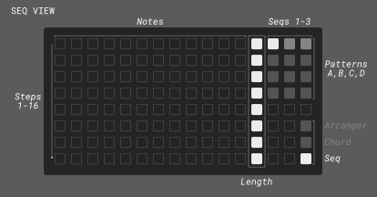
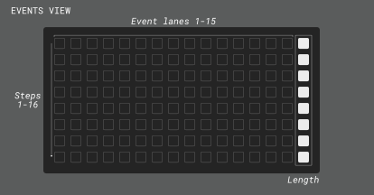

# Dreamsequence

Chord-based sequencer, arpeggiator, and harmonizer for Monome Norns+Grid

Required: Monome Norns (**v2.7.6 or later**) and Grid

Optional: Crow, Just Friends, Disting EX, MIDI sequencers/controllers

[Dreamsequence demo and basics on YouTube](https://youtu.be/Z6plHOHKwdg)

---

# Intro

Dreamsequence is a chord-based sequencer, arpeggiator, harmonizer, and arranger for Monome Norns+Grid.

Depending on your need, it can be your primary live performance tool, a compositional assistant, a generative sequencing playground, or just some thing you poke at that happens to make nice-sounding beeps.

The joy of using Dreamsequence is in its intuitive, theory-informed interactivity that allows us to explore various ways of reinterpreting simple musical patterns. Dreamsequence does not aim to be a fully-featured sequencer that can do anything and everything. In fact, sequences are limited to just 8 steps at the moment. But I think you will be delighted by what can be done with these simple inputs.

While fun all by itself, Dreamsequence really opens up when you add friends (anything that can send CV or MIDI notes), in which case it becomes a Voltronesque band leader capable of processing external musical data streams through its harmonizers. Sequences and harmonies can be intelligently merged with natural sounding results.

For those looking to make experimental music that goes beyond randomization and LFOs (not that there's anything wrong with that), Dreamsequence features an Arranger and Event scheduling system that lets you create your own procedural layer for controlling (or ceding to chaos) every aspect of your creation over the course of time. If you've ever enjoyed the feeling of creating a monster modular synth patch that may or may not have become sentient at some point along the way, you'll be rewarded by spending some time with Events.

I hope you have as much fun using Dreamsequence as I have had creating it, and I'd love to hear about how you're using it at https://llllllll.co/t/dreamsequence

Cheers,
Dan

--- 

# Overview

This Overview will explain how the components that make up Dreamsequence operate. It's a bit dry and technical, so if you are more of the skim-the-manual type, feel free to skip ahead to the [Grid interface](https://github.com/dstroud/dreamsequence/edit/main/README.md#grid-interface) guide and keep the [Norns interface](https://github.com/dstroud/dreamsequence/edit/main/README.md#norns-interface) guide handy for reference.

 > **_NOTE:_** Dreamsequence suppports saving/loading of your song through the system PARAMETERS>>PSET menu but you should expect these saves to break when doing updates. I'll do my best to notify of breaking changes in patch notes, but things will be missed and I recommend you wrap up any work before updating.

## Chord sequencer
*Grid-based chord pattern sequencer*
- The chord pattern sequencer is the heart of Dreamsequence, always broadcasting an "active" chord that the rest of Dreamsequence uses to create sequences and harmonies.
- The active chord can be sent to an output for playback (MIDI, Norns engine, i2c, etc...) or it can be muted.
- Chord patterns are references to chord degrees (I-VII) across two octaves. If you're not a music theory nerd, this just means that the palette of chords that Grid offers will always sound nice together and we can change the mood of the song by simply switching to a different mode which will change all the chords for us and cascade those changes to everything else using the active chord.
- 4 chord patterns (A, B, C, D) can be saved then switched between in a quantized manner using Grid (sort of like Ableton Live's Session mode) or the Arranger.
- New patterns and some basic song/engine randomizations can be procedurally generated by holding down the Chord view key on Grid (last column, row 7) and pressing K3. Or hold rows 7 and 8 then press K3 to generate Chords and Seq together.

## Seq (sequencer/arp)
*Grid-based pattern sequencer or arpeggiator (formerly ARP)*
- The Seq can operate based on the chord sequencer as an arpeggiator, run independently, or in any number of hybrid modes of your choosing.
- Seq currently has just 8 notes. This may seem limiting at first, but the idea is see how much juice we can squeeze out of the sequence by using techniques like sequence triggering, resetting, pattern transformation, note mapping, etc...
- Four ways of configuring Grid's note mapping are available in the Seq "Notes" menu:
	- Triad: play notes from active chord (arpeggiator style)
	- 7th: play notes from active chord + 7th interval (arpeggiator style)
	- Mode+transp.: play notes in the selected mode but apply a diatonic transposition based on the active chord degree
	- Mode: play notes in the selected mode irrespective of the active chord (step sequencer style)

 		> **_TIP:_** play with mismatched Chord step length and Seq step lengths, leaving spaces in your Chord sequence, then play with the "Start on" and "Reset on" settings. And don't forget Events!

- New patterns and some basic engine randomizations can be procedurally generated by holding down the Seq view key on Grid (last column, row 8) and pressing K3. Or hold rows 7 and 8 then press K3 to generate Chord and Seq patterns together.

## MIDI Harmonizer
*Note reprocessor for chords, sequences, arpeggios, whatever*
- Transforms incoming MIDI to play notes using the same "Notes" options as Seq:
	- Triad: play notes from active chord (arpeggiator style)
	- 7th: play notes from active chord + 7th interval (arpeggiator style)
	- Mode+transp.: play notes in the selected mode but apply a diatonic transposition based on the active chord degree
	- Mode: play notes in the selected mode irrespective of the active chord (step sequencer style)
  
- Ideas:
  - Turn a synced step sequencer into a chord-aware secondary arpeggio, melody, bassline, etc...
  - Improvise with a MIDI controller in a live performance (no dud notes!).
  - Use a looping MIDI clip from a synced DAW to generate more complex chord voicings and timings (e.g. adding some swing).

## CV Harmonizer
*Magical sample and hold + quantizer + chord/mode remapping (requires Crow)*
- A trigger recieved at Crow input 2 will sample the voltage at input 1 and use this to play a note using the same "Notes" options as Seq:
	- Triad: play notes from active chord (arpeggiator style)
	- 7th: play notes from active chord + 7th interval (arpeggiator style)
	- Mode+transp.: play notes in the selected mode but apply a diatonic transposition based on the active chord degree
	- Mode: play notes in the selected mode irrespective of the active chord (step sequencer style)
- Rests can be inserted by enabling the "Auto-rest" menu option and triggering the same voltage repeatedly within a chord step.
  
- Ideas:
  - Process CV from your eurorack sequencer then send it back out via Crow outputs 1-2, like a chord quantizer. 
  - Turn LFOs, function generators, S&H modules, etc... into sequencers.
  - Use trigger/clock/voltage sources for novel sequence timing or to inject some chaos into a merged output.

## Arranger
*Like a DAW but [worse/better]*
- Sequences playback of chord patterns (A, B, C, D) and is the entry point to the Event Editor.

- Events set, increment, randomize, or incite parameters to "wander" throughout your arrangement, with clamping or wrapping value ranges and probability control. Events can be used like rudimentary DAWesque automation lanes or they can be used more sparingly to reconfigure your patch at certain key points in your arrangement.

---

# Grid interface

The Chord view is used to program chord patterns A-D. Since the Seq and harmonizers can create notes based on the active chord, this is typically where you'll begin composing.

- Sequence plays from top to bottom and sequence length is set using column 15.

- Chords are selected using columns 1-14 which represent chord degrees I-VII across two octaves. Pressing and holding a key will display the corresponding chord on the Norns screen Pattern Dashboard (upper right). A setting is available via K1>>PARAMETERS>>EDIT>>PREFERENCES to change that readout to show chord names or Roman numeral chord degrees.

- Rows 1-4 of the rightmost column represent 4 chord patterns: A, B, C, D.
  - Tapping a pattern will turn off the Arranger and cue that pattern to play once the current pattern is completed.
  - While stopped/paused, double-tapping a pattern will turn off the Arranger and immediately jump to that pattern. Likewise, tapping the currently playing pattern once will turn off the Arranger and reset the current pattern.
  - Holding one pattern and tapping on another will copy and paste chords from the held pattern without causing the pattern/cue to change.

- The last three keys on the bottom of the rightmost column switch between Arranger, Chord, and Seq views.
  - Holding the Chord view key enables alternate functions:
    - E2 rotates the looped portion of the chord sequence.
    - E3 shifts the chord pattern left or right, decrementing or incrementing chord degrees.
    - K3 generates a new chord sequence and also randomizes some related parameters like mode, key, and tempo.
    - Holding the Chord+Seq view keys together enables K3 to generate both a new chord sequence and a new Seq.

----------------------------------------------------------------------------------------------------------------------

The Seq view is used to program the notes in the monophonic sequence/arpeggio/strum pattern.

- Each column represents a different note pitch, determined by one of the following "Notes" Seq menu options:
	- Triad: columns 1-3 map to notes 1-3 from the active chord interpreted as a triad. Columns 4-6 play the same notes one octave up, etc..
	- 7th: columns 1-4 map to notes 1-4 from the active chord interpreted as a 7th chord. Columns 5-8 play the same notes one octave up, etc..
	- Mode+transp.: columns 1-7 play notes from the selected mode and apply a diatonic transposition based on the active chord degree. Columns 8-14 play the same one octave up. Example: In C Major degree I, columns 1-7 would be C, D, E, F, G, A, B. Degree ii would result in D, E, F, G, A, B, C.
	- Mode: columns 1-7 play notes from the selected mode, columns 8-14 play the same one octave up.

- Seq plays from top to bottom and sequence length is set using column 15. After completing the sequence, the playhead will reset to the beginning and wait to start playback again based on the Seq "Start on" setting.

- The last three keys on the bottom of the rightmost column switch between Arranger, Chord, and Seq views.
  - Holding the Seq view key enables alternate functions:
    - E2 rotates the looped portion of the Seq pattern.
    - E3 shifts the Seq pattern left or right.
    - K3 generates a new Seq pattern.
    - Holding the Seq+Chord view keys together enables K3 to generate both a new chord sequence and a new Seq.

----------------------------------------------------------------------------------------------------------------------

The Arranger view is used to sequence chord patterns and enter the Events view.

- Rows 1-4 correspond to chord patterns A-D and columns 1-16 represent "segments" of the Arranger sequence. The Arranger length automatically resizes to the rightmost set pattern and any gaps in the sequence are filled in lighter colors to indicate that the previous chord pattern will be sustained. If the first segment isn't filled it will default to pattern A or it will grab the last populated pattern (since the Arranger loops).

- Row 5 is the Arranger Timeline, which illuminates segments contains one or more events. Holding down a key on the Arranger Timeline will enable alternate functions:
  - E3 shifts the selected segment and subsequent segments to the right or left depending on the direction of rotation.
  - K2 will cue the playhead to jump to the selected segment after the current segment is finished.
  - K3 enters the Events view view (see next section).
  - Holding a segment on the timeline and tapping on another will copy and paste events from the held segment. You can also hold a segment and tap rows 1-4 to set a pattern and paste events at the same time.

- Grid keys on the bottom left enable or disable the Arranger and Arranger Loop mode, respectively.

- Page keys 1-4 extend the arranger beyond 16 steps. Note that the arranger view does not currently follow the playhead off-screen so it's up to you to chase it down.
 
- The last three keys on the bottom of the rightmost column switch between Arranger, Chord, and Seq views. 

----------------------------------------------------------------------------------------------------------------------

The Events view is used to manage the scheduling of parameter changes and functions at certain points in the Arrangement.

- Events view is entered by holding down a segment on the Arranger Timeline (row 5) then pressing K3. Think of it as zooming in on that segment- and thus the chord pattern (A-D).

- Grid displays a view of events in the Arranger segment, where events fire left-to-right then top-to-bottom (like reading in English).
  - Rows 1-8 represent each step in the segment's chord pattern, just like on the Grid chord view. We don't show a playhead moving from top to bottom but it might help to imagine it. Grid keys will be dimly-illuminated to indicate the length of the assigned pattern (A-D). Note that you can create events beyond the range of the chord pattern's length- they just won't fire.
  - Columns 1-16 are event 'lanes' that fire left-to-right just before the chord on that step plays.
    
  	> **_TIP:_** To make it easier to keep track of your events, consider dedicating one lane/column to a certain type of event, such as having chord velocity changes in lane 1, pattern manipulations in lane 2, etc.. or just embrace chaos.

- Tapping on an unpopulated/dim event position will open the event settings and display "(New)" in the header. Settings will default to the last touched event so you can just tap a key, change a value, save, and repeat x times to build a sequence of related events.
    
- Tapping on a populated/bright event will open the event settings for that event and display "(Saved)" in the header. Making any changes to the settings will display "(Edited)" in the header.

- While viewing an event's settings, use E2 and E3 to select menus and make changes. K3 saves and closes the event settings screen, and K2 deletes the event. If you don't want to delete or save changes to an event just tap the illuminated event slot on Grid and it will revert to the saved state so you can exit with K3.

- Holding one event and tapping on one or more slots will copy and paste the settings from the held event- this can also be used to paste an empty event over a populated one, effectively deleting it.

- If no event is selected immediately after launching the Events view or after deleting/saving an event, K3 will take you back to the Arranger and holding K2 until the countdown completes will delete all events in the segment.

---

# Norns interface

## Norns keys and encoders

- Key 1 (K1): System menus

- Key 2 (K2): Pause/Stop(2x)
	- Default K2 behavior is to pause playback on a single press and stop on a second press.
	- Pausing is quantized to occur at the end of a chord step, based on the current Step Length setting.
	- Stopping resets the active chord pattern and will reset the Arranger if it is enabled.
  	- Under certain conditions, alternate functions are enabled and will be shown in the footer section at the bottom of the Norns screen:
    		- While holding down an Arranger Timeline key: cue the playhead to jump to the selected segment after the current segment is finished.
    		- While in the Events view screen: delete selected event or hold to delete all events in the segment.

- Key 3 (K3): Play
	- Default K3 behavior K3 starts playback (except when syncing to Link clock)
 	- This can also cancel a pending pause if you catch it before the end of the current chord step.
	- Under certain conditions, alternate functions are enabled and will be shown in the footer section at the bottom of the Norns screen:
		- While holding down an Arranger Timeline key: enter Event view.
    		- While in the Events view screen: save event or return back to Arranger.
    		- While holding Chord, Seq, or Chord+Seq Grid view keys (last two keys on the rightmost column): Generate a new chord pattern, Seq pattern, or both.

- Encoder 2 (E2): Select menu
  - Scroll up/down to select a menu.
  - In certain states, alternate functions are enabled: 
    - While holding Chord or Seq Grid view keys (last two keys on the rightmost column): rotate the looped portion of the active pattern up or down.

- Encoder 3 (E3): Edit menu
  - Changes the value of the selected menu item, including changing the 'page' on top level menus.
  - In certain states, alternate functions are enabled: 
    - While holding Chord or Seq Grid view keys (last two keys on the rightmost column): shift the selected pattern left or right.
    - While holding down a key on the Arranger Timeline (row 5): shift the selected segment and following segments to the right or left depending on the direction of rotation.

## Norns screen

Most of your work on Norns will be done through 5 main menus that look like the example above. Scrolling to the top menu (GLOBAL in the example above) with E2 will allow you to browse using E3. Before taking a closer look at the contents of these menus, let's take a look at the mini dashboards on the right side of the screen.

----------------------------------------------------------------------------------------------------------------------
 
### Pattern Dashboard

- This dashboard gives us a summary of transport status, the current chord pattern (A-D) and active chord.
- The numbers in the top left of the dash provide information about the current pattern in the format 'PATTERN'.'CURRENT STEP'/'PATTERN LENGTH'. Example: “A.3/4” means pattern A, step 3 of 4 total. ‘RST’ appears when pattern has been reset.
- Play/pause/stop symbols in the upper right will flash when a status change is pending, such as when waiting for Link sync to start or waiting for the current chord step to complete before pausing. Pressing pause/start can cancel pending changes.
- In the center of the dash, the active chord will be displayed. Holding down a chord sequence key on the Chord Grid view will temporarily overwrite this to indicate the chord that corresponds to the held key. The chord readout can be changed from chord name to chord degree using K1>>PARAMETERS>>EDIT>>PREFERENCES>>"Chords as"

	> **_TIP:_** Active chord reflects the CHORD>>"Chord type" menu option (Triad or 7th) but each sequencer/harmonizer can override this with the similiar "Notes" menu.

----------------------------------------------------------------------------------------------------------------------

### Arranger Dashboard

- Dashboard will be brightly illuminated when Arranger is enabled, and dimmed when disabled.
- The numbers in the top left indicate the current Arranger segment and step in the format 'SEGMENT'.'STEP'. "1.3" in the example above means the Arranger is on step 3 of the 1st Arranger segment. "RST" indicates the Arranger has been reset to its initial position.
- To the right, a symbol will indicate if the Arranger is in Loop mode (circular symbol as in the example above) or One-shot mode (arrow symbol). This symbol will flash when on the last segment of the Arranger as a heads-up.
- In the middle of the dashboard, a mini chart shows the current and upcoming Arranger segments. One advantage this dashboard has over Grid for live performances is that it gives an indication of segment/chord pattern length.
- At the bottom of the chart is a timeline that highlights any steps that have an event. In the example above, events occur on the first step of the 2 upcoming segments, and on every step of the last segment.
- At the very bottom of the dash is a readout of the remaining time in the arrangement.
- Interrupting the Arranger (by turning it off manually on the Arranger Grid view or changing chord patterns on the Chord Grid view) will turn it off and enter a suspended state where the current chord pattern continues to play in a loop. In this state, the dashboard changes to show
	-  The segment the Arranger will resume on once it has turned on and and resyncronizes and the number of steps remaining until that can occur. Formatted as 'RESUMING SEGMENT'.'STEPS UNTIL RESYNC' 
	- "LP" or "EN" indicates that we are on the last segment of the arrangement and resuming the Arranger will result in looping (LP) to the beginning or ending (EN) of the arrangement, depending on the Arranger mode.
	- The remaining time in arrangement upon arranger resume. Time remaining on the active pattern is not counted because it’s technically not part of the arrangement.
    
----------------------------------------------------------------------------------------------------------------------

### Menus

The left portion of the Norns screen displays one of the following "pages" and associated menu items:
  - GLOBAL <> CHORD <> SEQ <> MIDI HARMONIZER <> CV HARMONIZER
 
To navigate between pages, use E2 to scroll to the top of the list of menu items until the page name is highlighted, then use E3 to change the page. To change a menu item, simply scroll down the list using E2 and change its value using E3. < and > symbols will appear when you are at the end of the range of possible values. Descriptions of each page and menu options follow.

#### GLOBAL menu

- Mode: 9 modes: Major, Natural Minor, Harmonic Minor, Melodic Minor, Dorian, Phrygian, Lydian, Mixolydian, Locrian.

- Key: Global transposition of +/- 12 semitones.

- Tempo: sets Norns system clock tempo in BPM.

- Clock: System clock setting.
	- Internal and MIDI clock sources work and have full transport support. MIDI clock out ports must be set via K1>>PARAMETERS>>CLOCK

		> **_TIP:_** It’s possible to finagle a sort of count-in when syncing to MIDI by sending an external start, stopping on Dreamsequence (K2 2x), then scheduling a clean punch-in on the next beat using K3. This avoids the age-old issue of timing being a little off on the first beat when MIDI devices sync.

 	- Link works but using K3 to start transport is disabled due to a bug with clock.link.start() clobbering running clocks. Code wizards: please contact me if you'd like to poke around in the Norns code to help troubleshoot.
	- Crow clock source is not supported at this time.

- Crow clock: Frequency of the pulses from Crow out port 3. Defaults to note-style divisions but Pulses Per Quarter Note (PPQN) are also available by scrolling left. Note that higher PPQN settings are likely to result in instability. _At launch, Dreamsequence sets the Norns system clock "crow out" parameter to "off" since Dreamsequence generates its own clock pulses for Crow that only runs when the script's transport is playing. It will revert changes upon quitting the script._

- Dedupe <: This enables and sets the threshold for detecting and de-duplicating repeat notes at each output. This can be particularly helpful when merging sequences from different sources (say combining harmonizer with chords). Rather than trying to send the same note twice (potentially resulting in truncated notes or phase cancellation issues), this will let the initial note pass and filter out the second note if it arrives within the specified period of time.

- Chord preload: This setting enables the sequencer to fetch upcoming chord changes slightly early for processing the harmonizer inputs. This compensates for situations where the incoming note may arrive slightly before the chord change it's intended to harmonize with, such as when playing on a keyboard and hitting a note just before the chord change. This does not affect the timing of Chord and Seq playback.

- C-gen: Which algorithm is used for generating _Chord_ patterns. The default value picks an algorithm randomly.

- S-gen: Which algorithm is used for generating _Seq_ patterns. The default value picks an algorithm randomly.

#### CHORD menu

- Output: Where the output of the chord sequence is sent for playback. Some menu items are output-specific.
  - Mute: Still sends active chords to the Seq and harmonizers, they just won't play directly. 
  - Engine: Norns PolyPerc engine.
  - MIDI: Output on the selected MIDI port.
  - ii-JF: Just Friends Eurorack module requires Crow connected via i2c.
  - Disting: Disting EX Eurorack module requires Crow connected via i2c.

- Chord type: Selects between triads and 7th chords and displays the chord readout as such. Note that each sequence source can set this independently so it's possible for the Chord sequencer to output triads while the other sources output 7ths (and vice versa).

- Octave: Shifts output from -2 to +4 octaves.

- Spread: Raises the highest note in the chord by this many octaves while keeping the lowest note at the original octave and redistributing the remaining note(s) between. Ex: Octave 1 and Spread 3 will result in a Cmaj voiced as C1, E2, G3.

- Inversion: Incrementally shifts the lowest note up an octave so that 1 = first inversion, 2 = second inversion, etc... Multiples of 3 (for triads) or 4 (for 7ths) will effectively transpose the sequence up an octave which might be desired when incrementing this parameter with an event automation.

- Step length: The length of each step/row in the chord pattern, relative to 1 measure. Values ending in T are tuplets.

- Duration (_Engine, MIDI Disting_): Chord note duration relative to 1 measure. Values ending in T are tuplets.

- Amp: (_Engine, Just Friends_): Either Norns sound engine amplitude in percent or Just Friends amplitude in volts (0-5v).

- Cutoff (_Engine_): Norns sound engine filter frequency offset.

- Fltr tracking (_Engine_): Amount of "Keyboard tracking" applied to the Norns sound engine filter. Higher values will result in a higher filter cutoff for higher pitched notes. Final filter frequency = note frequency * filter tracking + cutoff. (y = mx + b slope-intercept).

- Gain (_Engine_): Norns sound engine gain setting.

- Pulse width (_Engine_): Norns sound engine square-wave based pulse width.

- Port (_MIDI_): Port for MIDI output.

- Channel (_MIDI_): Channel for MIDI output.

- Velocity (_MIDI, Disting_): Note velocity.

- Mod wheel: (_MIDI_): Send MIDI control change 1 value out to the configured MIDI port and channel.

#### SEQ menu

- Output: Where the output of the Seq is sent for playback. Some menu items are output-specific.
  - Mute: Seq still plays but there is no sound output.
  - Engine: Norns PolyPerc engine.
  - MIDI: Output on the selected MIDI port.
  - Crow: Outputs a monophonic sequence via Crow for Eurorack and other CV-capable gear. See [Crow Patching](https://github.com/dstroud/dreamsequence/blob/main/README.md#crow-patching). 
  - ii-JF: Just Friends Eurorack module requires Crow connected via i2c.
  - Disting: Disting EX Eurorack module requires Crow connected via i2c.
  
- Notes: Four ways of configuring Grid's note mapping are available:
  - Triad: columns 1-3 map to notes 1-3 from the active chord interpreted as a triad. Columns 4-6 play the same notes one octave up, etc..
	- 7th: columns 1-4 map to notes 1-4 from the active chord interpreted as a 7th chord. Columns 5-8 play the same notes one octave up, etc..
	- Mode+transp.: columns 1-7 play notes from the selected mode and apply a diatonic transposition based on the active chord degree. Columns 8-14 play the same one octave up. Example: In C Major degree I, columns 1-7 would be C, D, E, F, G, A, B. Degree ii would result in D, E, F, G, A, B, C.
	- Mode: columns 1-7 play notes from the selected mode, columns 8-14 play the same one octave up.

- Start on: The sequence always tries to play until it completes, at which point it loops to be the beginning and is ready to start again as soon as it receives the signal to do so. This menu option determines what can send that signal to start:
  - Seq end: as soon as the sequence ends, it will start itself in a loop.
  - Step: start Seq when the chord sequencer advances a step.
  - Chord: start Seq when the chord sequencer advances to a step containing a chord (empty steps are ignored). Useful for turning Seq into a chord strummer, or to layer notes on top of the chord, building alternative chord types and voicings.
  - Cue: start seq Seq when it recieves a "Start" event or the "Start" param is triggered via K1>>PARAMETERS>>EDIT>>SEQ (also MIDI/OSC mappable so this can be called by external sources).

	> **_NOTE:_**  "Start" events/PMAP triggers can be combined with any of the above configurations for additional control.

- Reset on: The sequence can be forced to reset before its normal end using this setting. Depending on when the reset occurs, this can prevent the sequence from reaching its end, keeping it in a suspended loop.
  - Step: reset Seq when the chord sequencer advances a step.
  - Chord: reset Seq when the chord sequencer advances to a step containing a chord (empty steps are ignored).
  - Stop: reset Seq when the transport is stopped and patterns are reset (not on pause).

	> **_TIP:_** "Reset" events/PMAP triggers can be combined with any of the above configurations for additional control.

  
- Octave: Shifts output from -2 to +4 octaves.

- Step length: The length of each step/row in the Seq pattern, relative to 1 measure. Values ending in T are tuplets.

- Duration (_Engine, Crow, MIDI, Disting_): Seq note duration relative to 1 measure. Values ending in T are tuplets.

- Amp: (_Engine, Just Friends_): Either Norns sound engine amplitude in percent or Just Friends amplitude in volts (0-5v).

- Cutoff (_Engine_): Norns sound engine filter frequency offset.

- Fltr tracking (_Engine_): Amount of "Keyboard tracking" applied to the Norns sound engine filter. Higher values will result in a higher filter cutoff for higher pitched notes. Final filter frequency = note frequency * filter tracking + cutoff. (y = mx + b slope-intercept).

- Gain (_Engine_): Norns sound engine gain setting.

- Pulse width (_Engine_): Norns sound engine square-wave based pulse width.

- Port (_MIDI_): Port for MIDI output.

- Channel (_MIDI_): Channel for MIDI output.

- Velocity (_MIDI, Disting_): Note velocity.

- Mod wheel: (_MIDI_): Send MIDI control change 1 value out to the configured MIDI port and channel.

- Output (_Crow_): Select between trigger or Attack Decay (AD) envelope to be sent from Crow out 2.

- AD env. skew: Amount the AD envelope will be skewed, where 0 = Decay only, 50 = triangle, and 100 = Attack only.

#### MIDI HARMONIZER menu

- Output: Where the output of the harmonizer is sent for playback. Some menu items are output-specific.
  - Mute: No sound is output.
  - Engine: Norns PolyPerc engine.
  - MIDI: Output on the selected MIDI port.
  - Crow: Outputs a monophonic sequence via Crow for Eurorack and other CV-capable gear. See [Crow Patching](https://github.com/dstroud/dreamsequence/blob/main/README.md#crow-patching). 
  - ii-JF: Just Friends Eurorack module requires Crow connected via i2c.
  - Disting: Disting EX Eurorack module requires Crow connected via i2c.
  
- Notes: Four ways of mapping incoming MIDI notes to output notes are available. This works just like the Seq but instead of choosing a column on Grid, we use the incoming note value starting from C1.
    - Triad: notes C1-D1 map to notes 1-3 from the active chord interpreted as a triad. Notes D#1-F1 play the same notes one octave up, etc..
	  - 7th: columns C1-D#1 map to notes 1-4 from the active chord interpreted as a 7th chord. Columns E1-G1 play the same notes one octave up, etc..
	  - Mode+transp.: beginning with note C1, incoming notes are mapped to the mode configured in GLOBAL>>Mode, then a diatonic transposition based on the active chord degree is applied.
	  - Mode: beginning with note C1, incoming notes are mapped to the mode configured in GLOBAL>>Mode.
   
- Octave: Shifts output from -2 to +4 octaves.

- Duration (_Engine, Crow, MIDI_): Note duration relative to 1 measure. Values ending in T are tuplets. _Currently, Dreamsequence always uses this value regardless of how long the source note is sustained._

- Amp: (_Engine, Just Friends_): Either Norns sound engine amplitude in percent or Just Friends amplitude in volts (0-5v).

- Cutoff (_Engine_): Norns sound engine filter frequency offset.

- Fltr tracking (_Engine_): Amount of "Keyboard tracking" applied to the Norns sound engine filter. Higher values will result in a higher filter cutoff for higher pitched notes. Final filter frequency = note frequency * filter tracking + cutoff. (y = mx + b slope-intercept).

- Gain (_Engine_): Norns sound engine gain setting.

- Pulse width (_Engine_): Norns sound engine square-wave based pulse width.

- Port in (_MIDI): MIDI port used for the MIDI harmonizer (accepts all channels).

- Port out (_MIDI_): Port for MIDI output.

- Channel (_MIDI_): Channel for MIDI output.

- Pass velocity (_MIDI_): Option to use the incoming MIDI velocity for the outgoing note.

- Velocity (_MIDI, Disting_): Note velocity (only available for MIDI output when pass velocity = false).

- Mod wheel: (_MIDI_): Send MIDI control change 1 value out to the configured MIDI port and channel.

- Output (_Crow_): Select between trigger or Attack Decay (AD) envelope to be sent from Crow out 2.

- AD env. skew: Amount the AD envelope will be skewed, where 0 = Decay only, 50 = triangle, and 100 = Attack only.

#### CV HARMONIZER menu

- Output: Where the output of the harmonizer is sent for playback. Some menu items are output-specific.
  - Mute: No sound is output.
  - Engine: Norns PolyPerc engine.
  - MIDI: Output on the selected MIDI port.
  - Crow: Outputs a monophonic sequence via Crow for Eurorack and other CV-capable gear. See [Crow Patching](https://github.com/dstroud/dreamsequence/blob/main/README.md#crow-patching). 
  - ii-JF: Just Friends Eurorack module requires Crow connected via i2c.
  - Disting: Disting EX Eurorack module requires Crow connected via i2c.
  
- Notes: Four ways of mapping voltage send to Crow input 1 to notes are available. This works just like the Seq but instead of choosing a column on Grid, we use the incoming voltage which is then quantized to 1v/oct or 1 semitone increments.
    - Triad: voltage of 0v, 1/12v, 2/12v map to notes 1-3 from the active chord interpreted as a triad. Voltage of 3/12v, 4/12v, 5/12v play the same notes one octave up, etc..
	  - 7th: columns voltage of 0v, 1/12v, 2/12v, 3/12v map to notes 1-4 from the active chord interpreted as a 7th chord. Voltage of 4/12v, 5/12v, 6/12v play the same notes one octave up, etc..
	  - Mode+transp.: beginning with note 0v and increaseing with each 1/12v increment, incoming voltage is mapped to the mode configured in GLOBAL>>Mode, then a diatonic transposition based on the active chord degree is applied.
	  - Mode: beginning with note 0v and increaseing with each 1/12v increment, incoming voltage is mapped to the mode configured in GLOBAL>>Mode.
  
- Auto-rest: When true, this option will suppress the same note when it is repeated consecutively within one chord step, resulting in a rest. This can be a useful way of adding rest functionality into analog sequencers that don't support such a feature.

- Octave: shifts output from -2 to +4 octaves.

- Duration (_Engine, Crow, MIDI_): Note duration relative to 1 measure. Values ending in T are tuplets.

- Amp: (_Engine, Just Friends_): Either Norns sound engine amplitude in percent or Just Friends amplitude in volts (0-5v).

- Cutoff (_Engine_): Norns sound engine filter frequency offset.

- Fltr tracking (_Engine_): Amount of "Keyboard tracking" applied to the Norns sound engine filter. Higher values will result in a higher filter cutoff for higher pitched notes. Final filter frequency = note frequency * filter tracking + cutoff. (y = mx + b slope-intercept).

- Gain (_Engine_): Norns sound engine gain setting.

- Pulse width (_Engine_): Norns sound engine square-wave based pulse width.

- Port (_MIDI_): Port for MIDI output.

- Channel (_MIDI_): Channel for MIDI output.

- Velocity (_MIDI, Disting_): Note velocity.

- Mod wheel: (_MIDI_): Send MIDI control change 1 value out to the configured MIDI port and channel.

- Output (_Crow_): Select between trigger or Attack Decay (AD) envelope to be sent from Crow out 2.

- AD env. skew: Amount the AD envelope will be skewed, where 0 = Decay only, 50 = triangle, and 100 = Attack only.

---

# Preferences
- Persistent preferences can be set for the following parameters via K1>>PARAMETERS>>EDIT>>PREFERENCES
	- Default pset: Automatically load the last-saved pset (and data) on script launch. 
	- Chords as: Global menu option selects between displaying chords names (Gmaj) or as chord degrees (VII).
	- Crow pullup: i2c pullup resistors can be set On (default) or Off.
 
---

# Crow Patching

Dreamsequence supports using Crow to send and recieve CV and triggers:
- Crow IN 1: CV used to determine note pitch of the CV harmonizer. Can be unquantized or quantized. Attenuation recommended
- Crow IN 2: Trigger (rising past 2 volts) in will sample the CV on Crow IN 1 and send a note from the CV harmonizer
- Crow OUT 1: "Crow" output V/oct out
- Crow OUT 2: "Crow" output trigger or 10v attack/decay envelope out
- Crow OUT 3: Clock out (beat-division or PPQN) set in "Global:Crow clock" menu item
- Crow OUT 4: A trigger can be sent from this output by scheduling an [Arranger Event](https://github.com/dstroud/dreamsequence/edit/main/README.md#events-view). More to come.
